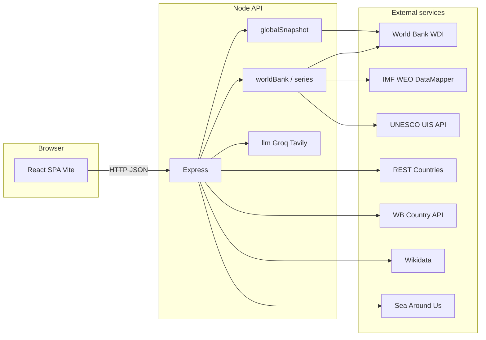

# Architecture

## 1. System context

## 2. Repository layout

| Path | Responsibility |
|------|----------------|
| `frontend/` | React 18, TypeScript, Vite, Tailwind, React Router, Recharts |
| `backend/` | Express API, metric catalog, ingestion, merge pipeline, cache |
| `package.json` (root) | Workspaces; `npm run dev` runs backend + frontend concurrently |

## 3. Frontend routes

| Path | Page component |
|------|----------------|
| `/` | `Dashboard.tsx` |
| `/global` | `GlobalAnalytics.tsx` |
| `/pestel` | `Pestel.tsx` |
| `/porter` | `Porter.tsx` |
| `/business` | `BusinessAnalytics.tsx` |
| `/assistant` | `Assistant.tsx` |
| `/sources` | `Sources.tsx` |

Shared chrome: `Layout.tsx` (nav, footer, `ApiToastStack`, `ApiTransportPanel`).

## 4. Backend API surface (summary)

| Method | Path | Purpose |
|--------|------|---------|
| GET | `/api/health` | Liveness |
| GET | `/api/metrics` | Metric dictionary + `shortLabel` |
| GET | `/api/data-providers` | Institution roles and merge narrative |
| GET | `/api/countries` | ISO3 country list |
| GET | `/api/country/:cca3` | REST Countries + Wikidata + EEZ enrichment |
| GET | `/api/country/:cca3/wb-profile` | WB income/region metadata |
| GET | `/api/country/:cca3/series` | Time-series bundle (query: `metrics`, `start`, `end`) |
| GET | `/api/dashboard/comparison` | Peer comparison rows |
| GET | `/api/global/snapshot` | Map/table snapshot for one metric + year fallback |
| GET | `/api/global/table` | Wide table by region/category |
| GET | `/api/global/wld-series` | World aggregate WLD series |
| GET | `/api/compare` | Multi-country single metric series |
| GET | `/api/analysis/correlation-global` | Pearson r + scatter points |
| GET | `/api/ilo-isic-divisions` | Porter sector list |
| POST | `/api/cache/clear` | Clear server cache |
| POST | `/api/bootstrap/warm` | Background warmup of country metric bundles (**202** + `started`, or **200** + `skipped` if `DISABLE_BOOTSTRAP_WARMUP=1`) |
| POST | `/api/assistant/chat` | Assistant with optional Groq/Tavily |
| POST | `/api/analysis/pestel` | PESTEL analysis |
| POST | `/api/analysis/porter` | Porter analysis |
| POST | `/api/analysis/correlation` | Country pairwise correlation |

## 5. Data pipeline (country series)

High-level order (see `dataProviders.ts` for narrative):

1. Fetch **primary WDI** code per metric; optional **fallback WDI** code for null years.
2. Merge **IMF WEO** where `imfWeoIndicator` is defined (null years only).
3. Merge **UNESCO UIS** where `uisIndicatorId` is defined (null years only).
4. Apply **cross-metric derivations** (e.g. implied per-capita splits, OOSC proxies, age-band consistency) in `seriesCompletion` / related modules.
5. Apply **range completion**: edge fill, interior interpolation (except GDP growth step rule), short terminal carry-forward, optional **WLD proxy** for remaining nulls.
6. Clamp percentage-like series to 0–100 where applicable.
7. Attach **`provenance`** on points for audit (e.g. `reported`, `imf_weo`, `interpolated`, `wld_proxy`).

Cache: SHA-truncated key over sorted metric IDs + country + range; TTL ~20 minutes.

## 6. Key frontend modules

| Module | Role |
|--------|------|
| `api.ts` | Typed `getJson` / `postJson`, tracks transport for panel/toasts |
| `lib/chartSeries.ts` | Merge series for Recharts, labour-derived rows |
| `lib/chartGranularity.ts` | Annual vs multi-year aggregation |
| `lib/metricDisplay.ts` | `shortLabel` + catalog labels |
| `components/charts/ChartTableToggle.tsx` | Chart/table + local fullscreen + group fullscreen handoff |
| `components/charts/VisualizationStepper.tsx` | Stacked embed + group fullscreen slideshow |
| `components/charts/VizGalleryContext.tsx` | Context for group fullscreen routing |
| `components/pestel/*` | PESTEL layout, themes (`pestelTheme.ts`), SWOT grid |
| `components/porter/*` | Porter forces hub, themes (`porterTheme.ts`) |
| `components/assistant/MessageContent.tsx` | Assistant reply: GFM tables, links, bold, `[D#]`/`[W#]` chips, web sources split, consecutive duplicate table suppression |
| `pages/Assistant.tsx` | Composer, country sync, Web-first/Auto, Steps & actions, persona banner wrapper, starter categories |
| `lib/assistantSuggestionCategories.ts` | Grouped starter prompts (six categories) |
| `lib/assistantAnswerPresentation.ts` | Maps `attribution` + `citations` → source category + persona copy |
| `lib/assistantWebSources.ts` | Parses `**Web source(s)**` appendix for link cards |

## 7. Strategy and AI pipeline (summary)

- **PESTEL / Porter:** Build an indicator digest from the catalog and country bundle; optional Tavily retrieval; optional Groq JSON generation; **sanitize** LLM partials against indicators, static profile, and web corpus (`pestelGrounding.ts`); **merge** with the data scaffold (`mergePestelAnalysis` in `pestelAnalysis.ts`); **polish** user-visible strings. SWOT quadrants are deduplicated across strengths / weaknesses / opportunities / threats when padding merged lists.
- **Assistant:** `classifyAssistantIntent` and helpers in `assistantIntel.ts` choose **statistics / compare / overview / general_web** behavior, **Tavily skip** when platform payload suffices (unless web priority), and **focus-metric scope**. Parallel fetch builds dashboard block, **global ranking** (`assistantRankingBlock.ts`), and **multi-country comparison** slices. `compactAssistantRetrievalForLlm` (`assistantCitationContext.ts`) emits **[D#]**-prefixed lines and **one** web bullet for **[W1]** using `pickTopTavilyWebResults`. User prompt passed through `clampAssistantUserForLlm` (`assistantPromptBudget.ts`). **Groq** via `groqChatWithFallbackForUseCase("assistant", …)` with timeout, transport retry, and rate-limit backoff (`llm.ts`). **Polish** + **strip redundant ranking tables** (`assistantReplyPolish.ts`, `assistantReplyTableDedupe.ts`). Final `reply` may be `rankingMarkdown + "\n\n" + narrative`. **Fallback:** `tavilyAssistantFallbackReply` when every Groq model fails. Response includes **`attribution: string[]`** and **`citations`** for the UI.

## 8. Build & deploy

- **Dev:** `npm run dev` — API `:4000`, Vite `:5173` with proxy `/api`.
- **Prod:** `npm run build` — `backend/dist` + `frontend/dist`; serve SPA and reverse-proxy `/api` to Node, or single-origin static + API as documented in root README.

## 9. Security notes

- API keys **only** on server (`dotenv`); never bundled to the client.
- CORS `origin: true` for development flexibility; tighten for production if needed.
- JSON body limit 1 MB on Express.
