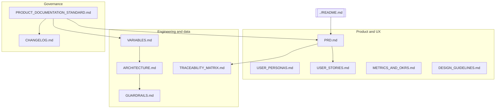

# Country Analytics Platform — Documentation

Canonical product and engineering documentation for the **Country Analytics Platform**. Use this page as the entry point, then open the linked artifacts below.

---

## Documentation map

---

## Document index

| Document | Purpose |
|----------|---------|
| [PRODUCT_DOCUMENTATION_STANDARD.md](./PRODUCT_DOCUMENTATION_STANDARD.md) | How documentation is structured, owned, and reviewed (enterprise-style) |
| [PRD.md](./PRD.md) | Vision, scope, features, functional and non-functional requirements, success criteria |
| [USER_PERSONAS.md](./USER_PERSONAS.md) | Primary audiences, goals, and constraints |
| [USER_STORIES.md](./USER_STORIES.md) | User stories and acceptance-oriented scenarios |
| [VARIABLES.md](./VARIABLES.md) | Environment and API variables, **Assistant POST body**, derived UI series, **48**-metric catalog, PESTEL digest keys, lineage + **Assistant pipeline** diagrams |
| [METRICS_AND_OKRS.md](./METRICS_AND_OKRS.md) | Product health metrics and example OKRs |
| [DESIGN_GUIDELINES.md](./DESIGN_GUIDELINES.md) | Visual language, app shell and feature themes, components, accessibility |
| [TRACEABILITY_MATRIX.md](./TRACEABILITY_MATRIX.md) | Requirements and stories → implementation → verification |
| [GUARDRAILS.md](./GUARDRAILS.md) | Data, AI, legal, and technical limitations |
| [ARCHITECTURE.md](./ARCHITECTURE.md) | System context, routes, API surface, data pipeline |
| [CHANGELOG.md](./CHANGELOG.md) | Dated documentation–product alignment notes (not a code release log) |

**Source of truth for metric definitions:** `backend/src/metrics.ts` and `GET /api/metrics` (includes `shortLabel` from `backend/src/metricShortLabels.ts`).

**Repository root:** [README.md](../README.md) — quick start, stack, environment variables, and operational notes.

---

## Maintenance

When you change behavior, update the **smallest set of docs that keeps the suite truthful**: at minimum, **PRD** or **USER_STORIES**, **TRACEABILITY_MATRIX** for traceable features, and **VARIABLES** or **ARCHITECTURE** for new APIs or metrics. Follow [PRODUCT_DOCUMENTATION_STANDARD.md](./PRODUCT_DOCUMENTATION_STANDARD.md).
