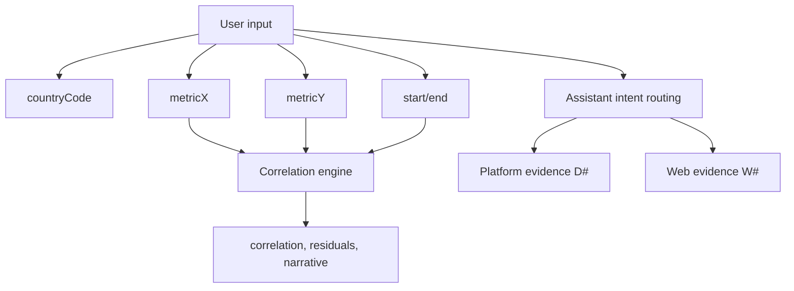

# Variables Documentation

This document explains key variables with friendly wording for beginners.

## Environment variables

| Variable | Friendly Name | Definition | Rule | Location | Example |
| --- | --- | --- | --- | --- | --- |
| `PORT` | API Port | Backend listening port | Integer, default 4000 | `backend/src/index.ts` | `4000` |
| `GROQ_API_KEY` | LLM Key | Enables model generation | Required for live LLM path | `backend/src/llm.ts` | `gsk_...` |
| `TAVILY_API_KEY` | Web Key | Enables web retrieval | Required for live web context | `backend/src/llm.ts` | `tvly-...` |

## Request variables

| Variable | Friendly Name | Definition | Rule | Location | Example |
| --- | --- | --- | --- | --- | --- |
| `countryCode` | Focus Country | Country context | ISO3 uppercase | assistant/analysis APIs | `IDN` |
| `metricX` | Variable 1 | First metric | Must exist in catalog | correlation APIs | `gdp_per_capita` |
| `metricY` | Variable 2 | Second metric | Must exist in catalog | correlation APIs | `life_expectancy` |
| `start`,`end` | Year Range | Analysis window | Clamped by bounds | series/global APIs | `2005`,`2025` |

## Derived variables

| Variable | Friendly Name | Definition | Formula | Location | Example |
| --- | --- | --- | --- | --- | --- |
| `yoy` | Year-over-Year | Relative annual change | `(latest-prior)/abs(prior)*100` | dashboard/assistant logic | `+3.9%` |
| `correlation` | Pearson r | Association strength | Pearson formula | correlation engine | `0.62` |
| `% of top` | Relative to leader | Value vs top metric value | `(value/max(values))*100` | comparison rendering | `83.4%` |

## Relationship chart

