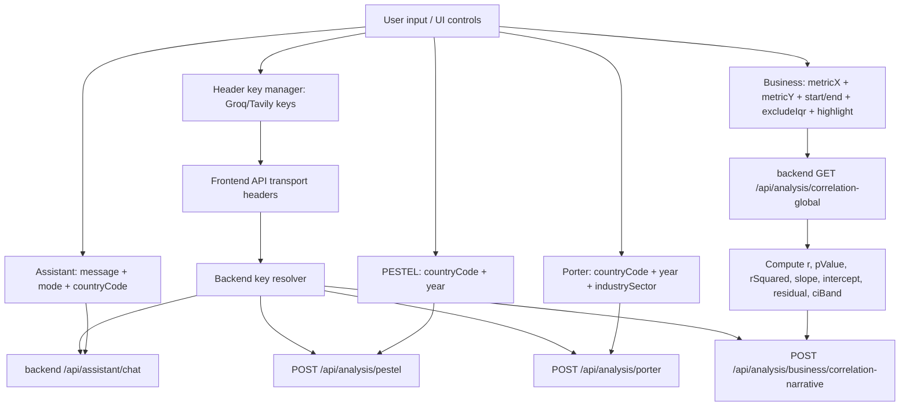

# Variables Documentation (Implementation-Aligned)

This document explains the variables that the application uses in API requests, UI interactions, and analysis computations.

It is written for readers who may be new to this codebase: each variable entry includes a technical name, a friendly explanation, the rule/formula used by the system, where it appears in the application, and an example value.

## 1) Glossary: “metric” vs “variable”

- A **metric** is an indicator definition (for example, `gdp_per_capita`). See `docs/METRIC_CATALOG.md`.
- A **variable** is a value flowing through the app and APIs (for example, `metricX`, `startYear`, `excludeIqr`, or derived analytics values like `residual`).

## 2) Environment Variables

Environment variables configure backend behavior and model/web retrieval access.

### Environment variable table

| Variable Name | Friendly Name | Definition | Formula / Rule | Location in the apps | Example |
| --- | --- | --- | --- | --- | --- |
| `PORT` | API Port | Backend server listening port | Parsed as number; default `4000` if unset | `backend/src/index.ts` | `4000` |
| `DISABLE_BOOTSTRAP_WARMUP` | Warmup Switch | Disables background cache warmup | If equal to `"1"`, warmup is skipped | `backend/src/index.ts`, `backend/src/dataWarmup.ts` | `1` |
| `GROQ_API_KEY` | Groq API Key | Enables Groq model calls (assistant/PESTEL/Porter/business narratives) | If unset/empty, AI generation endpoints use deterministic/scaffold fallbacks | `backend/src/index.ts`, `backend/src/llm.ts` | `gsk_...` |
| `TAVILY_API_KEY` | Tavily Web Key | Enables Tavily live web retrieval | If unset/empty, web grounding paths are disabled | `backend/src/index.ts`, `backend/src/llm.ts`, `backend/src/*Tavily*.ts` | `tvly_...` |
| `GROQ_MODEL` | Legacy Groq Model Override | Legacy model override (used when no use-case override is set) | Use-case specific model env var overrides take priority | `backend/src/llm.ts` | `llama-3.3-70b-versatile` |
| `GROQ_MODEL_PESTEL` | PESTEL Primary Model | Primary Groq model used for PESTEL generation | Selected as primary candidate for `useCase="pestel"` | `backend/src/llm.ts` | `llama-3.1-8b-instant` |
| `GROQ_MODEL_PORTER` | Porter Primary Model | Primary Groq model used for Porter generation | Selected as primary candidate for `useCase="porter"` | `backend/src/llm.ts` | `openai/gpt-oss-120b` |
| `GROQ_MODEL_BUSINESS` | Business Primary Model | Primary Groq model used for correlation narrative generation | Selected as primary candidate for `useCase="business"` | `backend/src/llm.ts` | `llama-3.3-70b-versatile` |
| `GROQ_MODEL_ASSISTANT` | Assistant Primary Model | Primary Groq model used for analytics assistant chat | Selected as primary candidate for `useCase="assistant"` | `backend/src/llm.ts` | `llama-3.1-8b-instant` |
| `GROQ_FALLBACK_MODELS` | Global Groq Fallback Models | Global list of fallback models (used after per-use-case fallbacks) | Parsed as comma/space separated list | `backend/src/llm.ts` | `qwen/qwen3-32b,llama-3.1-8b-instant` |
| `GROQ_FALLBACK_MODELS_PESTEL` | PESTEL Fallback Models | Per-use-case fallback list for PESTEL | Parsed as comma/space separated list | `backend/src/llm.ts` | `qwen/qwen3-32b` |
| `GROQ_FALLBACK_MODELS_PORTER` | Porter Fallback Models | Per-use-case fallback list for Porter | Parsed as comma/space separated list | `backend/src/llm.ts` | `qwen/qwen3-32b` |
| `GROQ_FALLBACK_MODELS_BUSINESS` | Business Fallback Models | Per-use-case fallback list for Business | Parsed as comma/space separated list | `backend/src/llm.ts` | `qwen/qwen3-32b` |
| `GROQ_FALLBACK_MODELS_ASSISTANT` | Assistant Fallback Models | Per-use-case fallback list for Assistant | Parsed as comma/space separated list | `backend/src/llm.ts` | `qwen/qwen3-32b` |
| `VERCEL` | Vercel Runtime Flag | Indicates serverless runtime in Vercel | When `VERCEL="1"`, backend does not open local listener | `backend/src/index.ts` | `1` |

## 3) Request Variables (API Inputs)

Request variables are the fields you send to endpoints. Backend validation rules are applied before data retrieval and analysis.

### 3.1 Assistant

#### `POST /api/assistant/chat`

| Variable Name | Friendly Name | Definition | Formula / Rule | Location in the apps | Example |
| --- | --- | --- | --- | --- | --- |
| `message` | User Question | Natural-language query | Required and non-empty (trimmed) | `frontend/src/pages/Assistant.tsx`, `backend/src/index.ts` | `Compare Indonesia and Brazil on GDP per capita and population` |
| `countryCode` | Focus Country | ISO3 country context for grounding | Uppercase and validated as `^[A-Z]{3}$` | Assistant chat only | `IDN` |
| `webSearchPriority` | Web-First Mode | Force web retrieval priority for the turn | If `true`, treated as web-priority | Assistant chat body | `true` |
| `assistantMode` | Assistant Mode (Optional) | Legacy/alternate flag for web priority | If equal to `"web_priority"`, treated like `webSearchPriority=true` | Assistant chat body | `"web_priority"` |
| `X-User-Groq-Api-Key` | User Groq Key Header | User-provided Groq key attached from frontend API layer | Header overrides server env key for request scope | `frontend/src/api.ts`, `backend/src/index.ts` | `gsk_...` |
| `X-User-Tavily-Api-Key` | User Tavily Key Header | User-provided Tavily key attached from frontend API layer | Header overrides server env key for request scope | `frontend/src/api.ts`, `backend/src/index.ts` | `tvly_...` |

### 3.1.1 Key validation endpoint

#### `POST /api/keys/validate`

| Variable Name | Friendly Name | Definition | Formula / Rule | Location in the apps | Example |
| --- | --- | --- | --- | --- | --- |
| `X-User-Groq-Api-Key` | Groq key for validation | Header sent to Groq model-list probe | Returns `ok=true` on HTTP 200 from provider | Header key panel and backend validator | `gsk_...` |
| `X-User-Tavily-Api-Key` | Tavily key for validation | Header sent to Tavily minimal search probe | Returns `ok=true` on HTTP 200 from provider | Header key panel and backend validator | `tvly_...` |

### 3.2 PESTEL

#### `POST /api/analysis/pestel`

| Variable Name | Friendly Name | Definition | Formula / Rule | Location in the apps | Example |
| --- | --- | --- | --- | --- | --- |
| `countryCode` | Country | ISO3 country for analysis | Required and validated as `^[A-Z]{3}$` | `frontend/src/pages/Pestel.tsx` → backend | `IDN` |
| `year` | Context Year | Analysis horizon used in digest and web windows | Clamped to platform-allowed year | PESTEL API body | `2025` |

### 3.3 Porter

#### `POST /api/analysis/porter`

| Variable Name | Friendly Name | Definition | Formula / Rule | Location in the apps | Example |
| --- | --- | --- | --- | --- | --- |
| `countryCode` | Country | ISO3 country for analysis | Required and validated as `^[A-Z]{3}$` | `frontend/src/pages/Porter.tsx` → backend | `IDN` |
| `year` | Context Year | Analysis horizon used for digest and web | Clamped to platform-allowed year | Porter API body | `2025` |
| `industrySector` | Industry / Sector (ILO-ISIC) | Industry framing used in Porter web queries and scaffold | Default is `"10 - Manufacture of food products"` if empty | Porter API body | `10 - Manufacture of food products` |

### 3.4 Global / Dashboard Analytics Inputs

#### `GET /api/dashboard/comparison`

| Variable Name | Friendly Name | Definition | Formula / Rule | Location in the apps | Example |
| --- | --- | --- | --- | --- | --- |
| `cca3` | Focus Country | ISO3 code | Required and validated as `^[A-Z]{3}$` | Dashboard comparison route | `IDN` |
| `year` | Data Year Target | Requested year for comparison block | Clamped; if missing uses `currentDataYear()-1` | Dashboard comparison route | `2023` |

#### `GET /api/country/:cca3/series`

| Variable Name | Friendly Name | Definition | Formula / Rule | Location in the apps | Example |
| --- | --- | --- | --- | --- | --- |
| `cca3` | Country | ISO3 in path | Uppercased | `backend/src/index.ts` | `IDN` |
| `metrics` | Metric IDs | Comma-separated metric IDs to fetch | If omitted, backend fetches all metrics | Country series route | `gdp_per_capita,life_expectancy` |
| `start` | Start Year | Beginning of time range | Clamped to platform bounds | Country series route | `2005` |
| `end` | End Year | End of time range | Clamped to platform bounds | Country series route | `2026` |

#### `GET /api/global/snapshot`

| Variable Name | Friendly Name | Definition | Formula / Rule | Location in the apps | Example |
| --- | --- | --- | --- | --- | --- |
| `metric` | Global Metric | Metric ID used for snapshot | Must exist in catalog; default `gdp` | `frontend/src/components/global/*` | `gdp` |
| `year` | Requested Year | Target year for snapshot | If missing uses `currentDataYear()-1` | Global snapshot route | `2024` |

#### `GET /api/global/table`

| Variable Name | Friendly Name | Definition | Formula / Rule | Location in the apps | Example |
| --- | --- | --- | --- | --- | --- |
| `year` | Data Year Target | Target year | Clamped; if missing uses `currentDataYear()-1` | Global table route | `2023` |
| `region` | Region Filter | Region grouping | Defaults to `"All"` | Global table route | `"All"` |
| `category` | Category | Table category | One of `general|financial|health|education` | Global table route | `health` |

#### `GET /api/global/wld-series`

| Variable Name | Friendly Name | Definition | Formula / Rule | Location in the apps | Example |
| --- | --- | --- | --- | --- | --- |
| `metrics` | Metric IDs | Metrics to fetch for world aggregate | Required; comma-separated IDs | WLD series route | `gdp,life_expectancy` |
| `start` | Start Year | Beginning time range | Clamped | WLD series route | `2000` |
| `end` | End Year | End time range | Clamped | WLD series route | `2026` |

#### `GET /api/compare`

| Variable Name | Friendly Name | Definition | Formula / Rule | Location in the apps | Example |
| --- | --- | --- | --- | --- | --- |
| `countries` | Country List | ISO3 codes to compare | Required and parsed as comma-separated list | Comparison route | `IDN,BRA` |
| `metric` | Metric | Metric ID | Must exist; default `gdp_per_capita` | Comparison route | `gdp_per_capita` |
| `start` | Start Year | Beginning year | Clamped | Comparison route | `2005` |
| `end` | End Year | Ending year | Clamped | Comparison route | `2026` |

### 3.5 Business Analytics (Correlation)

#### `GET /api/analysis/correlation-global`

| Variable Name | Friendly Name | Definition | Formula / Rule | Location in the apps | Example |
| --- | --- | --- | --- | --- | --- |
| `metricX` | Variable 1 | X-axis metric ID | Must exist in metric catalog | Business Analytics page | `gdp_per_capita` |
| `metricY` | Variable 2 | Y-axis metric ID | Must exist in metric catalog | Business Analytics page | `life_expectancy` |
| `start` | Start Year | Included years from `start..end` | Clamped; inclusive loop | Correlation global route | `2000` |
| `end` | End Year | Included years from `start..end` | Resolved to WDI-compatible year | Correlation global route | `2023` |
| `excludeIqr` | Exclude IQR outliers | Removes points flagged by IQR rule | Parsed as boolean string (`"true"`) | Correlation global route | `true` |
| `highlight` | Highlight Country | ISO3 code to highlight on plot | Uppercased by caller | Business Analytics page | `IDN` |

### 3.6 Country exchange-rate response variables

#### `GET /api/country/:cca3` (FX-related output fields)

| Variable Name | Friendly Name | Definition | Formula / Rule | Location in the apps | Example |
| --- | --- | --- | --- | --- | --- |
| `usdFxRate` | USD FX Rate | Returned quote for one USD in target local currency | Prefer ECB daily quote; fallback to World Bank `PA.NUS.FCRF` when needed | `backend/src/index.ts`, `frontend/src/pages/Dashboard.tsx` | `98.34` |
| `usdFxRateAsOf` | FX As-Of Date | Date attached to returned quote | Daily quote date for ECB; annual fallback date for WB | Dashboard exchange card | `2026-04-29` |
| `usdFxCurrency` | FX Currency Code | Currency code used for quote | Resolved from currency candidates (country metadata + fallback mapping) | Dashboard exchange card | `ALL` |
| `usdFxSource` | FX Source Label | Human-readable provider/source label | `ECB via Frankfurter` or `World Bank PA.NUS.FCRF` variants | Dashboard exchange card | `ECB via Frankfurter` |

#### `POST /api/analysis/correlation`

This endpoint computes a correlation for a single country between `metricX` and `metricY` across overlapping years.

| Variable Name | Friendly Name | Definition | Formula / Rule | Location in the apps | Example |
| --- | --- | --- | --- | --- | --- |
| `countryCode` | Country | ISO3 | Required and validated | (Single-country correlation usage) | `IDN` |
| `metricX` | Variable 1 | X metric | Must exist | Correlation endpoint | `gdp_per_capita` |
| `metricY` | Variable 2 | Y metric | Must exist | Correlation endpoint | `life_expectancy` |

#### `POST /api/analysis/business/correlation-narrative`

| Variable Name | Friendly Name | Definition | Formula / Rule | Location in the apps | Example |
| --- | --- | --- | --- | --- | --- |
| `metricX` | Metric X | X metric ID | Must exist | Business narrative request body | `gdp_per_capita` |
| `metricY` | Metric Y | Y metric ID | Must exist | Business narrative request body | `life_expectancy` |
| `labelX` | Label for X | Human label for metric X | Used verbatim in narrative strings | Business narrative request body | `GDP per capita` |
| `labelY` | Label for Y | Human label for metric Y | Used verbatim in narrative strings | Business narrative request body | `Life expectancy` |
| `startYear` | Narrative Start Year | Inclusive start | Numeric; used for window description | Business narrative request body | `2000` |
| `endYear` | Narrative End Year | Inclusive end | Numeric; used for window description | Business narrative request body | `2023` |
| `excludeIqr` | Outlier Toggle | Narrative refers to whether IQR outliers were removed | Boolean | Business narrative request body | `true` |
| `highlightCountryIso3` | Highlight ISO3 | Highlight country code | Optional string; if missing, highlight statements omitted | Business narrative request body | `IDN` |
| `highlightCountryName` | Highlight Name | Highlight country display name | Optional; if missing, highlight statements omitted | Business narrative request body | `Indonesia` |
| `correlation` | Correlation r | Pearson r (or null) | Backend treats null as “insufficient overlap” | Business narrative request body | `0.62` |
| `pValue` | p-value | String p-value returned by correlation engine | May be `null` | Business narrative request body | `<0.001` |
| `rSquared` | r² | Explained variance proxy (r²) | May be null | Business narrative request body | `0.38` |
| `slope` | Regression slope | Beta slope between X and Y | May be null | Business narrative request body | `1.23e-02` |
| `intercept` | Regression intercept | Regression intercept | May be null | Business narrative request body | `-14.7` |
| `n` | Point Count | Number of included country-year points | Numeric | Business narrative request body | `240` |
| `nMissing` | Missing Points Count | Count excluded due to missing X/Y | Numeric | Business narrative request body | `60` |
| `nIqrFlagged` | IQR Flagged Count | Number of points flagged by IQR | Numeric | Business narrative request body | `18` |
| `subgroups` | Region Subgroups | Region-level diagnostics | Array of `{ region, r, n, pValue }` | Business narrative request body | `[{...}]` |
| `highlightStats` | Highlight Stats | Derived stats for highlighted country | Optional; if missing, highlight narrative omitted | Business narrative request body | `{...}` |
| `residualDiagnostics` | Residual Diagnostics | Residual distribution stats | Optional; if missing, narrative omits residual detail | Business narrative request body | `{...}` |

## 4) Derived Variables (Computed Values)

Derived variables are computed by the backend (or sometimes by the frontend before sending to the narrative endpoint).

### 4.1 Year-over-year (assistant/dashboard)

`yoy` (Year-over-Year Change)

| Variable | Friendly Name | Definition | Formula / Rule | Where it appears | Example |
| --- | --- | --- | --- | --- | --- |
| `yoy` | YoY change | Relative change between latest available value and prior-year value | `((latest - prior) / abs(prior)) * 100` ; if `prior==0` or prior missing → null | Assistant ranking/comparison value rendering | `+4.3%` |

### 4.2 Correlation global (Pearson + regression)

These formulas are used in `backend/src/correlationGlobal.ts`.

| Variable | Friendly Name | Definition | Formula / Rule | Where it appears | Example |
| --- | --- | --- | --- | --- | --- |
| `correlation` | Pearson correlation r | Linear association strength across included points | `r = sum((x-mx)(y-my)) / sqrt(sum((x-mx)^2) * sum((y-my)^2))` | Correlation global route response | `0.62` |
| `pValue` | p-value | Statistical significance approximation | Uses t-statistic: `t = r * sqrt(n-2) / sqrt(max(1e-20, 1-r^2))`, then `p = 2 * (1 - normalCdf(|t|))` | Correlation global route response | `<0.001` |
| `rSquared` | Explained variance proxy | `r²` | `rSquared = r * r` | Correlation global route | `0.38` |
| `slope` | Regression slope | Beta slope for fitted line | `slope = dx==0 ? null : (r ?? 0) * sqrt(dy/dx)` | Correlation global route | `1.23e-02` |
| `intercept` | Regression intercept | Intercept of fitted line | `intercept = my - slope * mx` | Correlation global route | `-14.7` |
| `fitted` | Fitted Y | Predicted Y for each point | `fitted = intercept + slope * x` | Correlation points used for residuals | `71.0` |
| `residual` | Residual | Error term per point | `residual = y - fitted` | Correlation points and narrative | `-1.7` |

### 4.3 IQR outlier rule (used for excludeIqr)

| Variable | Friendly Name | Definition | Formula / Rule | Where it appears | Example |
| --- | --- | --- | --- | --- | --- |
| IQR outlier (X) | X outlier flag | Point is outlier in X | For X: `iqr = q3x - q1x`, `lower = q1x - 1.5*iqr`, `upper = q3x + 1.5*iqr`; outlier if `x < lower` or `x > upper` | Correlation global | flagged |
| IQR outlier (Y) | Y outlier flag | Point is outlier in Y | For Y: same rule as X using `q1y`/`q3y` | Correlation global | flagged |
| `nIqrFlagged` | Flagged points count | Total points flagged in either X or Y | `nIqrFlagged = count(flagged points)` | Correlation global response | `18` |

If `excludeIqr=true`, the backend removes any point whose `(countryIso3, year)` is flagged.

### 4.4 Confidence band (`ciBand`)

| Variable | Friendly Name | Definition | Formula / Rule | Where it appears | Example |
| --- | --- | --- | --- | --- | --- |
| `ciBand` | Confidence band | yLower/yUpper around fitted line | Uses `tCrit=1.96`, `mse = sse/(n-2)`, then `se = sqrt(mse*(1/n + (x-mx)^2/ssx))`; `yLower=yHat - tCrit*se`, `yUpper=yHat + tCrit*se` | Correlation global response | `{...}` |

### 4.5 Highlight stats and residual diagnostics

These are computed on the frontend in `frontend/src/pages/BusinessAnalytics.tsx`, then sent into the narrative endpoint.

| Variable | Friendly Name | Definition | Formula / Rule | Where it appears | Example |
| --- | --- | --- | --- | --- | --- |
| `highlightStats.meanX` | Highlight mean X | Mean of highlight country’s X values | Mean across highlight points | Business narrative payload | `4200` |
| `highlightStats.meanY` | Highlight mean Y | Mean of highlight country’s Y values | Mean across highlight points | Business narrative payload | `72.1` |
| `highlightStats.meanResidual` | Highlight mean residual | Average residual term on highlight points | Mean of residuals across highlight points | Business narrative payload | `0.12` |
| `highlightStats.meanFitted` | Highlight mean fitted | Mean fitted Y | Mean across fitted values | Business narrative payload | `71.9` |
| `highlightStats.nIqrOutliers` | Highlight IQR outlier count | Outlier count within highlight points | Count of highlight points where `isIqrOutlier=true` | Business narrative payload | `3` |
| `residualDiagnostics.meanAbsResidual` | Mean absolute residual | Mean of `abs(residual)` | Average of abs residuals | Business narrative payload | `2.4` |
| `residualDiagnostics.medianResidual` | Median residual | Middle value of residuals | Median of residuals | Business narrative payload | `-0.1` |
| `residualDiagnostics.residualIqr` | Residual IQR | IQR spread of residuals | `q3 - q1` of residuals | Business narrative payload | `1.6` |

### 4.6 Business Analytics delivery-control variables (frontend)

| Variable | Friendly Name | Definition | Formula / Rule | Where it appears | Example |
| --- | --- | --- | --- | --- | --- |
| `strictSelectedRange` | Strict Selected Range Mode | Toggle for strict-range-only requests | If `true`, no automatic fallback year-window retries | `frontend/src/pages/BusinessAnalytics.tsx` | `true` |
| `analysisDeliveryNote` | Delivery Note | UI explanation when fallback window is used | Set when reliability retries deliver a narrower window | Business Analytics result banner | `Primary request timed out; using last 12 years.` |
| `presentationMode` | Presentation Mode | Hides control/diagnostic chrome for review mode | Toggle by button or keyboard `P` | Business Analytics page | `true` |

## 5) Relationship Chart (Where variables connect)



## 6) Practical examples (copy-friendly)

### Example: correlation-global request

`GET /api/analysis/correlation-global?metricX=gdp_per_capita&metricY=life_expectancy&start=2000&end=2023&excludeIqr=true&highlight=IDN`

### Example: assistant ranking/comparison request

`POST /api/assistant/chat`

```json
{
  "message": "Rank Indonesia and Brazil on GDP per capita and show what % of the top each is.",
  "countryCode": "IDN",
  "webSearchPriority": false
}
```

## 7) Notes for beginners

- Always confirm that metric units match when comparing values.
- “Data year” may be earlier than “requested year” due to coverage and gap-fill logic.
- When `GROQ_API_KEY` or `TAVILY_API_KEY` is missing, the backend may switch to deterministic fallbacks.
