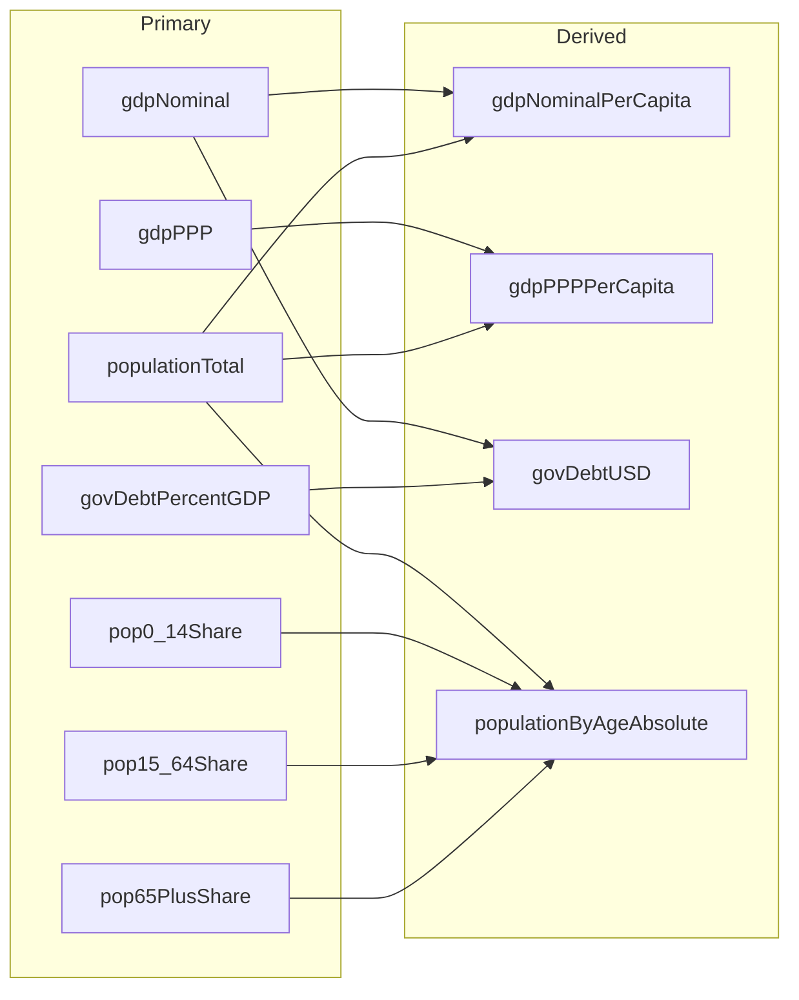
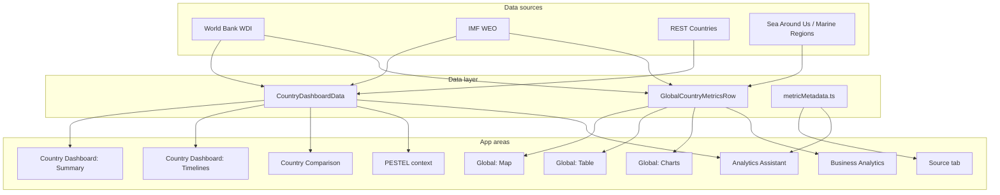

# Variables Documentation – Country Analytics Platform

This document provides a single reference for **all variables** used in the application: **data metrics** (displayed in the UI), **configuration constants**, and **environment variables**. Each entry includes **variable name**, **friendly name** (human-readable label used in the UI), **definition**, **formula** (where applicable), **location in the app**, and a concrete **example**. A **variable relationship and usage** section describes how variables connect to each other (e.g. derived metrics) and how they flow through the app. It is maintained in line with the **Product Documentation Standard** (`PRODUCT_DOCUMENTATION_STANDARD.md`).

**Related:** Per-metric metadata for the Source tab is defined in `src/data/metricMetadata.ts`. For engagement and OKR metrics, see `METRICS_AND_OKRS.md`. For product data metrics overview, see `PRODUCT_METRICS.md`.

---

## 1. Data Metrics (UI Variables)

These variables correspond to metrics shown in the Country Dashboard, Global view (map, table, Global Charts), Business Analytics, PESTEL context, and Analytics Assistant. IDs align with `MetricId` and related types in `src/types.ts`.

### 1.1 Financial

| Variable name | Friendly name | Definition | Formula | Location in app | Example |
|---------------|---------------|------------|---------|-----------------|---------|
| `gdpNominal` | GDP (Nominal, US$) | Gross domestic product at market prices in current US dollars. | GDP = C + I + G + (X − M); converted at official exchange rates. | Summary (Financial), Unified Timeline, Country Comparison, Global map/table/charts, Business Analytics scatter, Source tab. | 1.4T USD (Indonesia 2023). |
| `gdpPPP` | GDP (PPP, Intl$) | GDP in international dollars adjusted for purchasing power parity. | GDP (PPP) = GDP × PPP conversion factor. | Summary (Financial), Unified Timeline, Country Comparison, Global map/table/charts, Business Analytics, Source tab. | 4.2T Intl$. |
| `gdpNominalPerCapita` | GDP per Capita (Nominal, US$) | GDP per person in current US dollars. | GDP / Population. | Summary (Financial), Unified Timeline, Country Comparison, Global map/table/charts, Business Analytics scatter, Source tab. | 5,100 USD. |
| `gdpPPPPerCapita` | GDP per Capita (PPP, Intl$) | GDP per person in PPP terms. | GDP (PPP) / Population. | Summary (Financial), Unified Timeline, Country Comparison, Global map/table/charts, Business Analytics, Source tab. | 15,200 Intl$. |
| `inflationCPI` | Inflation (CPI, %) | Annual percentage change in the consumer price index. | ((CPI_t − CPI_{t−1}) / CPI_{t−1}) × 100. | Summary (Financial), Macro Indicators Timeline (economic), Global map/table/charts, Source tab. | 3.5%. |
| `interestRate` | Lending interest rate (%) | Bank lending rate (annual average). | Reported as annual average of bank lending rates. | Summary (Financial), Macro Indicators Timeline (economic), Global map/table/charts, Source tab. | 8.2%. |
| `govDebtPercentGDP` | Government debt (% of GDP) | General government gross debt as a percentage of GDP. | (Total government debt / GDP) × 100. | Summary (Financial), Macro Indicators Timeline (economic), Global map/table/charts, Source tab. | 39.2%. |
| `govDebtUSD` | Government debt (USD) | Government gross debt in current US dollars. | GDP × (Gov. debt % GDP / 100). | Summary (Financial), Country Comparison, Global map/table/charts, Source tab. | 548B USD. |
| `unemploymentRate` | Unemployment rate (% of labour force) | Unemployed as a percentage of the labour force. | (Unemployed / Labour force) × 100. | Summary (Financial), Macro Indicators Timeline (economic), Labour timeline, Global map/table/charts, Source tab. | 5.4%. |
| `unemployedTotal` | Unemployed (number of people) | Number of people unemployed and seeking work. | Labour force × (Unemployment rate / 100) or ILO-modelled estimate. | Unemployed & Labour Force Timeline, Global table/charts, Source tab. | 7.2M people. |
| `labourForceTotal` | Labour force (total) | Total labour force (employed plus unemployed seeking work). | Employed + Unemployed (seeking work). | Unemployed & Labour Force Timeline, Global table/charts, Source tab. | 134M people. |
| `povertyHeadcount215` | Poverty headcount ($2.15/day, %) | Share of population below the $2.15/day (2017 PPP) poverty line. | Share with consumption or income below $2.15/day. | Summary (Financial), Macro Indicators Timeline (economic), Global map/table/charts, Source tab. | 2.5%. |
| `povertyHeadcountNational` | Poverty headcount (national line, %) | Share of population below the national poverty line. | Share below the country-specific national poverty line. | Summary (Financial), Macro Indicators Timeline (economic), Global map/table/charts, Source tab. | 9.4%. |

### 1.2 Population

| Variable name | Friendly name | Definition | Formula | Location in app | Example |
|---------------|---------------|------------|---------|-----------------|---------|
| `populationTotal` | Population, total | Total de facto population. | Census and intercensal estimates; UN projections. | Summary (Health & demographics), Unified Timeline, Population Structure, Country Comparison, Global map/table/charts, Source tab. | 277M people. |
| `pop0_14Share` | Population 0–14 (% of total) | Population aged 0–14 as a percentage of total. | (Pop 0–14 / Total population) × 100. | Summary (Health & demographics), Population Structure timeline, Country Comparison (age breakdown), Global map/table/charts, Source tab. | 24.1%. |
| `pop15_64Share` | Population 15–64 (% of total) | Population aged 15–64 as a percentage of total. | (Pop 15–64 / Total population) × 100. | Summary (Health & demographics), Population Structure timeline, Country Comparison (age breakdown), Global map/table/charts, Source tab. | 68.2%. |
| `pop65PlusShare` | Population 65+ (% of total) | Population aged 65 and over as a percentage of total. | (Pop 65+ / Total population) × 100. | Summary (Health & demographics), Population Structure timeline, Country Comparison (age breakdown), Global map/table/charts, Source tab. | 7.7%. |
| `populationByAgeAbsolute` | Population by age group (absolute count) | Absolute count per age band (0–14, 15–64, 65+). | Total population × (Age-group share % / 100). | Population Structure timeline (tooltip and table show % and absolute, e.g. 25.3% · 65.2 Mn), Source tab. | 66.8M (0–14). |

### 1.3 Health

| Variable name | Friendly name | Definition | Formula | Location in app | Example |
|---------------|---------------|------------|---------|-----------------|---------|
| `lifeExpectancy` | Life expectancy at birth | Life expectancy at birth in years. | Period life expectancy from mortality tables. | Summary (Health & demographics), Unified Timeline, Global map/table/charts, Business Analytics, Source tab. | 69.2 years. |
| `maternalMortalityRatio` | Maternal mortality ratio (per 100,000 live births) | Maternal deaths per 100,000 live births. | (Maternal deaths / Live births) × 100,000. | Summary (Health & demographics), Macro Indicators Timeline (health), Global map/table/charts, Source tab. | 173 per 100k. |
| `under5MortalityRate` | Under-5 mortality rate (per 1,000 live births) | Under-5 deaths per 1,000 live births. | Probability of dying before age 5, per 1,000. | Summary (Health & demographics), Macro Indicators Timeline (health), Global map/table/charts, Source tab. | 22 per 1,000. |
| `undernourishmentPrevalence` | Prevalence of undernourishment (% of population) | Share of population with insufficient dietary energy intake. | (Insufficient energy intake population / Total) × 100. | Summary (Health & demographics), Macro Indicators Timeline (health), Global map/table/charts, Source tab. | 8.4%. |

### 1.4 Geography

| Variable name | Friendly name | Definition | Formula | Location in app | Example |
|---------------|---------------|------------|---------|-----------------|---------|
| `landAreaKm2` | Land area | Land area excluding water bodies and EEZ (km²). | Sum of land surface areas. | Summary (General – geography), Global map/table (General), Source tab. | 1,811,570 km². |
| `totalAreaKm2` | Total area | Total surface area (land plus inland water) in km². | Land area + inland water bodies. | Summary (General), Global map/table (General), Source tab. | 1,916,907 km². |
| `eezKm2` | Exclusive Economic Zone (EEZ) | Exclusive Economic Zone area in km². | Defined by UN Convention on the Law of the Sea. | Summary (General – geography), Global map/table (General), Source tab. | 6,159,032 km². |

### 1.5 Context / Country Metadata

| Variable name | Friendly name | Definition | Formula | Location in app | Example |
|---------------|---------------|------------|---------|-----------------|---------|
| `region` | Region | Geographic or economic region of the country. | World Bank regional classification. | Summary (General), Global table (General), Map metric selector, PESTEL/Assistant context, Source tab. | East Asia & Pacific. |
| `incomeLevel` | Income level | World Bank income classification. | Based on GNI per capita (updated annually). | Summary (General), Global table, PESTEL/Assistant context, Source tab. | Upper middle income. |
| `governmentType` | Government type | Form of government or political system. | — | Summary (General), Global table (General), Map metric selector, PESTEL/Assistant context, Source tab. | Presidential republic. |
| `headOfGovernmentType` | Head of government | Title of the chief executive. | — | Summary (General), Global table (General), Assistant context, Source tab. | President. |
| `capitalCity` | Capital city | Capital or seat of government. | — | Summary (General), PESTEL/Assistant context, Source tab. | Jakarta. |
| `currency` | Currency | Official currency: name, ISO code, and symbol where available. | — | Summary (General – Economy), Assistant context, Source tab. | Indonesian rupiah (IDR), symbol Rp. |
| `timezone` | Timezone | Primary timezone of the country (IANA). | — | Summary (General), Assistant context, Source tab. | Asia/Jakarta. |
| `locationAndGeography` | Location & geographic context | Where the country is located, continent, and neighbouring countries. Not a stored metric; answered by the Analytics Assistant via LLM and web search. | — | Analytics Assistant only (e.g. “Where is Indonesia located?”, “Neighbouring countries of France”); documented in Source tab under Country metadata & context. | “Indonesia is in Southeast Asia; neighbours: Malaysia, Papua New Guinea, Timor-Leste.” |

---

## 2. Configuration Constants

Defined in `src/config.ts` and used for year bounds and data coverage across the app.

| Variable name | Friendly name | Definition | Formula / Rule | Location in app | Example |
|---------------|---------------|------------|----------------|-----------------|---------|
| `DATA_MIN_YEAR` | Earliest data year | Earliest year allowed for data and filters. | Fixed constant. | Year range selector (Country Dashboard and Business Analytics), global data fetches. | 2000. |
| `DATA_MAX_YEAR` | Latest data year | Latest year considered “available” (data lag assumption). | currentYear − 2. | Year range selector, global data, PESTEL peer comparison year. | 2023 when current year is 2025. |

---

## 3. Environment Variables

Used for API keys and optional server/client configuration. Template: `.env.example`. **Never commit real keys.**

| Variable name | Definition | Use | Location in app | Example (placeholder) |
|---------------|------------|-----|-----------------|------------------------|
| `GROQ_API_KEY` | Groq API key (server-side). | Free-tier LLM when no user key. | Vite plugin `/api/chat`. | your-key-here |
| `VITE_GROQ_API_KEY` | Groq API key (client-side, optional). | Baked into build for public/demo. | Chat tab when no server key. | your-key-here |
| `TAVILY_API_KEY` | Tavily API key for web search. | Real-time answers; PESTEL supplemental search. | Vite plugin `/api/chat`. | your-key-here |
| `SERPER_API_KEY` | Serper API key (alternative web search). | Used when Tavily not set. | Vite plugin `/api/chat`. | your-key-here |
| `OPENAI_API_KEY` | OpenAI API key (server-side). | When user selects OpenAI model. | Vite plugin `/api/chat`. | your-key-here |
| `VITE_OPENAI_API_KEY` | OpenAI API key (client-side, optional). | Baked into build. | Chat tab settings. | your-key-here |
| `ANTHROPIC_API_KEY` | Anthropic API key (server-side). | For Claude models. | Vite plugin `/api/chat`. | your-key-here |
| `VITE_ANTHROPIC_API_KEY` | Anthropic API key (client-side, optional). | Baked into build. | Chat tab settings. | your-key-here |
| `GOOGLE_AI_API_KEY` | Google AI API key (server-side). | For Gemini models. | Vite plugin `/api/chat`. | your-key-here |
| `VITE_GOOGLE_AI_API_KEY` | Google AI API key (client-side, optional). | Baked into build. | Chat tab settings. | your-key-here |
| `OPENROUTER_API_KEY` | OpenRouter API key (server-side). | For OpenRouter models. | Vite plugin `/api/chat`. | your-key-here |
| `VITE_OPENROUTER_API_KEY` | OpenRouter API key (client-side, optional). | Baked into build. | Chat tab settings. | your-key-here |

---

## 4. World Bank Indicator Codes (WDI)

Used by `src/api/worldBank.ts` when calling the World Bank API. These codes map to the data metrics above.

| Variable (metric) | WDI Code |
|-------------------|----------|
| GDP (current US$) | NY.GDP.MKTP.CD |
| GDP, PPP | NY.GDP.MKTP.PP.CD |
| GDP per capita (current US$) | NY.GDP.PCAP.CD |
| GDP per capita, PPP | NY.GDP.PCAP.PP.CD |
| Inflation, consumer prices | FP.CPI.TOTL.ZG |
| Central government debt (% of GDP) | GC.DOD.TOTL.GD.ZS |
| Lending interest rate | FR.INR.LEND |
| Unemployment, total (% of labour force) | SL.UEM.TOTL.ZS |
| Unemployed, total | SL.UEM.TOTL |
| Labor force, total | SL.TLF.TOTL.IN |
| Poverty $2.15/day (2017 PPP) | SI.POV.DDAY |
| Poverty, national line | SI.POV.NAHC |
| Population, total | SP.POP.TOTL |
| Population 0–14 (% of total) | SP.POP.0014.TO.ZS |
| Population 15–64 (% of total) | SP.POP.1564.TO.ZS |
| Population 65+ (% of total) | SP.POP.65UP.TO.ZS |
| Life expectancy at birth | SP.DYN.LE00.IN |
| Maternal mortality ratio | SH.STA.MMRT |
| Under-5 mortality rate | SH.DYN.MORT |
| Prevalence of undernourishment | SN.ITK.DEFC.ZS |
| Land area | AG.LND.TOTL.K2 |
| Surface area | AG.SRF.TOTL.K2 |

---

## 5. TypeScript Types (Key Domain Variables)

From `src/types.ts`; these type names represent structured data used across the app.

| Type / interface | Definition | Location in app |
|------------------|------------|-----------------|
| `Frequency` | Time-series frequency. | Timeline sections (Unified, Macro economic/health, Labour, Population Structure), Global Charts. |
| `MetricId` | Union of all numeric metric IDs. | Map metric toolbar, Business Analytics X/Y selectors, metric metadata. |
| `TimePoint` | Single point in a time series. | All timeline and chart components. |
| `MetricSeries` | Time series for one metric. | TimeSeriesSection, MacroIndicatorsTimelineSection, LabourUnemploymentTimelineSection, PopulationStructureSection, GlobalChartsSection. |
| `CountrySummary` | Country metadata and latest snapshot. | SummarySection, chatContext, pestelContext, ChatbotSection, PESTELSection. |
| `CountryDashboardData` | Full dashboard payload for one country. | useCountryDashboard, SummarySection, all Country tab sections. |
| `GlobalCountryMetricsRow` | One row of global metrics for one country-year. | WorldMapSection, AllCountriesTableSection, GlobalChartsSection, BusinessAnalyticsSection, correlationAnalysis. |
| `CountryYearSnapshot` | Snapshot of all metrics for one country-year. | chatFallback, chatContext, PESTEL context. |

---

## 6. Data Quality and Fallbacks

- **Latest non-null:** The dashboard uses the latest non-null value up to the selected end year.
- **Year fallback:** The global loader steps backwards when a chosen year has no data.
- **Territory fallback:** 30+ territories use the parent country for inflation and interest rate (see `TERRITORY_FALLBACK_PARENT` in `worldBank.ts`).
- **IMF fallback:** Government debt (% GDP) and GDP (nominal) when World Bank returns empty.
- **Missing display:** "–" for null; no NaN or broken charts.

For full business rules and edge cases, see `docs/PRD.md` (Section 5) and `docs/PRODUCT_METRICS.md` (Section 9).

---

## 7. Variable relationships and usage in the app

This section describes how variables **connect to each other** (e.g. derived metrics) and how they **flow through the application** from data sources to the UI.

### 7.1 Derived variables

Some variables are **derived** from other variables (either in the API layer or in the UI). The table below lists the derivation relationship so that product and engineering can trace data lineage.

| Variable name | Friendly name | Formula | Input variables |
|---------------|---------------|---------|-----------------|
| `gdpNominalPerCapita` | GDP per Capita (Nominal, US$) | GDP / Population | `gdpNominal`, `populationTotal` |
| `gdpPPPPerCapita` | GDP per Capita (PPP, Intl$) | GDP (PPP) / Population | `gdpPPP`, `populationTotal` |
| `govDebtUSD` | Government debt (USD) | GDP × (Gov. debt % GDP / 100) | `gdpNominal`, `govDebtPercentGDP` |
| `populationByAgeAbsolute` | Population by age group (absolute count) | Total population × (Age-group share % / 100) | `populationTotal`, `pop0_14Share` / `pop15_64Share` / `pop65PlusShare` |

All other data metrics in Section 1 are **primary** (sourced directly from World Bank WDI, IMF, REST Countries, Sea Around Us, or Marine Regions).

### 7.2 Variable relationship diagram (derivation)

The following diagram shows how **derived variables** depend on **primary variables**. Arrows point from inputs to the derived metric.

### 7.3 Variable usage flow in the app

The following diagram shows how variables **flow from data sources** into **data structures** and then into **app areas** (screens and features). This clarifies where each variable is used across the product.

**Legend:** **CountryDashboardData** feeds the Country Dashboard (Summary, Timelines, Country Comparison), PESTEL context, and Analytics Assistant context. **GlobalCountryMetricsRow** feeds the Global map, table, Global Charts, and Business Analytics scatter. **metricMetadata.ts** feeds the Source tab and Assistant system prompt.

### 7.4 Quick reference: variable → app area

| App area | Variables used (key) |
|----------|----------------------|
| **Summary (General)** | region, incomeLevel, governmentType, headOfGovernmentType, capitalCity, currency, timezone, landAreaKm2, totalAreaKm2, eezKm2 |
| **Summary (Financial)** | gdpNominal, gdpPPP, gdpNominalPerCapita, gdpPPPPerCapita, govDebtPercentGDP, govDebtUSD, inflationCPI, interestRate, unemploymentRate, povertyHeadcount215, povertyHeadcountNational |
| **Summary (Health & demographics)** | populationTotal, pop0_14Share, pop15_64Share, pop65PlusShare, lifeExpectancy, maternalMortalityRatio, under5MortalityRate, undernourishmentPrevalence |
| **Unified Timeline** | gdpNominal, gdpPPP, gdpNominalPerCapita, gdpPPPPerCapita, populationTotal, lifeExpectancy |
| **Macro Indicators (economic)** | inflationCPI, interestRate, govDebtPercentGDP, unemploymentRate, povertyHeadcount215, povertyHeadcountNational |
| **Macro Indicators (health)** | maternalMortalityRatio, under5MortalityRate, undernourishmentPrevalence |
| **Labour timeline** | unemployedTotal, labourForceTotal |
| **Population Structure** | populationTotal, pop0_14Share, pop15_64Share, pop65PlusShare, populationByAgeAbsolute |
| **Country Comparison** | All financial, population, health, geography (selected country vs average vs global) |
| **Global map** | Any numeric metric + region, governmentType (from Map metric selector) |
| **Global table** | All metrics per country-year (General, Financial, Health & demographics columns) |
| **Global Charts** | Same as Global table, aggregated (unified, economic, health, population-structure series) |
| **Business Analytics** | Any two numeric metrics as X and Y (from global dataset) |
| **PESTEL / Analytics Assistant** | Country context (summary + metrics) and global data; location/geography from LLM and web search, not stored variables |
| **Source tab** | All variables documented in metric cards (Financial, Population, Health, Geography, Country metadata & context) |
