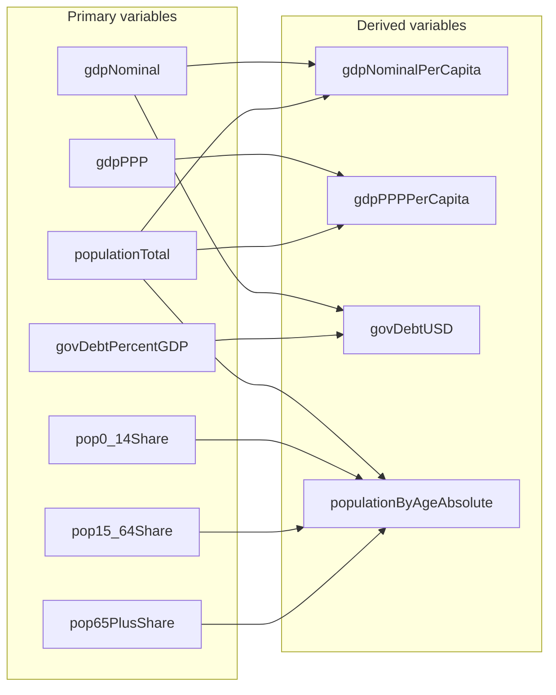
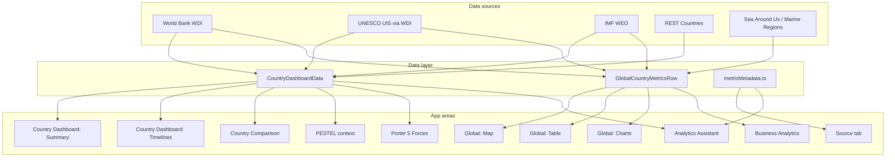

# Variables Documentation – Country Analytics Platform

This document is the **single reference** for all variables used in the Country Analytics Platform. It follows the **Product Documentation Standard** (`PRODUCT_DOCUMENTATION_STANDARD.md`) and provides **variable name**, **friendly name** (human-readable label), **definition**, **formula** (where applicable), **location in the app**, and a concrete **example** for each entry. A **variable relationship and usage** section describes how variables connect (e.g. derived metrics, data lineage) and flow through the application from sources to UI. Professional wording is used throughout to support product, design, and engineering alignment.

**How to read this document:** Use **Section 1** for a quick lookup of any data metric or context variable by name; **Section 2–3** for configuration and environment variables; **Section 5** for key TypeScript types. **Section 7** contains the **relationship chart** and **usage flow**: it shows which variables are derived from others and where each variable is used in the app (Summary, Timelines, Global map/table/charts, Business Analytics, PESTEL, Porter 5 Forces, Source tab, Analytics Assistant).

**Related:** Per-metric metadata for the Source tab is defined in `src/data/metricMetadata.ts`. For engagement and OKR metrics, see `METRICS_AND_OKRS.md`. For product data metrics overview, see `PRODUCT_METRICS.md`.

---

## 1. Data Metrics (UI Variables)

These variables correspond to metrics shown in the Country Dashboard, Global view (map, table, Global Charts), Business Analytics, PESTEL context, and Analytics Assistant. IDs align with `MetricId` and related types in `src/types.ts`.

### 1.1 Financial

| Variable name | Friendly name | Definition | Formula | Location in app | Example |
|---------------|---------------|------------|---------|-----------------|---------|
| `gdpNominal` | GDP (Nominal, US$) | Gross domestic product at market prices in current US dollars. Measures total value of goods and services produced within the country. | GDP = C + I + G + (X − M); converted at official exchange rates. | Summary (Financial), Unified Timeline, Country Comparison, Global map/table/charts, Business Analytics scatter, Source tab. | 1.4T USD (Indonesia 2023). |
| `gdpPPP` | GDP (PPP, Intl$) | Gross domestic product in international dollars adjusted for purchasing power parity. Enables comparison of living standards across countries. | GDP (PPP) = GDP × PPP conversion factor. | Summary (Financial), Unified Timeline, Country Comparison, Global map/table/charts, Business Analytics, Source tab. | 4.2T Intl$. |
| `gdpNominalPerCapita` | GDP per Capita (Nominal, US$) | Average economic output per person in current US dollars. | GDP / Population. | Summary (Financial), Unified Timeline, Country Comparison, Global map/table/charts, Business Analytics scatter, Source tab. | 5,100 USD. |
| `gdpPPPPerCapita` | GDP per Capita (PPP, Intl$) | Average purchasing power per person in PPP terms. | GDP (PPP) / Population. | Summary (Financial), Unified Timeline, Country Comparison, Global map/table/charts, Business Analytics, Source tab. | 15,200 Intl$. |
| `inflationCPI` | Inflation (CPI, %) | Annual percentage change in the consumer price index. Measures the rate at which prices of a basket of consumer goods and services change. | ((CPI_t − CPI_{t−1}) / CPI_{t−1}) × 100. | Summary (Financial), Macro Indicators Timeline (economic), Global map/table/charts, Source tab. | 3.5%. |
| `interestRate` | Lending interest rate (%) | The rate charged by banks on loans to prime customers. Reflects cost of borrowing and monetary policy stance. | Reported as annual average of bank lending rates. | Summary (Financial), Macro Indicators Timeline (economic), Global map/table/charts, Source tab. | 8.2%. |
| `govDebtPercentGDP` | Government debt (% of GDP) | General government gross debt as a percentage of GDP. Measures the government's total debt relative to the size of the economy. **When World Bank has no data for a country (e.g. China), the value is filled automatically from IMF World Economic Outlook (WEO).** | (Total government debt / GDP) × 100. | Summary (Financial), Macro Indicators Timeline (economic), Global map/table/charts, Source tab. | 39.2%. |
| `govDebtUSD` | Government debt (USD) | Total government gross debt in current US dollars. Derived from GDP and government debt as percentage of GDP. | GDP × (Gov. debt % GDP / 100). | Summary (Financial), Country Comparison, Global map/table/charts, Source tab. | 548B USD. |
| `unemploymentRate` | Unemployment rate (% of labour force) | Share of the labour force that is without work but available for and seeking employment. | (Unemployed / Labour force) × 100. | Summary (Financial), Macro Indicators Timeline (economic), Labour timeline, Global map/table/charts, Source tab. | 5.4%. |
| `unemployedTotal` | Unemployed (number of people) | Total number of people without work but available for and seeking employment. Based on ILO-modelled estimates. | Labour force × (Unemployment rate / 100) or ILO-modelled estimate. | Unemployed & Labour Force Timeline, Global table/charts, Source tab. | 7.2M people. |
| `labourForceTotal` | Labour force (total) | Total labour force: people ages 15 and older who supply labour for the production of goods and services. Includes employed and unemployed persons seeking work. | Employed + Unemployed (seeking work). | Unemployed & Labour Force Timeline, Global table/charts, Source tab. | 134M people. |
| `povertyHeadcount215` | Poverty headcount ($2.15/day, %) | Percentage of population living below the international poverty line of $2.15 a day (2017 PPP). Extreme poverty measure aligned with UN SDGs. | Share of population with consumption or income below $2.15/day (2017 PPP). | Summary (Financial), Macro Indicators Timeline (economic), Global map/table/charts, Source tab. | 2.5%. |
| `povertyHeadcountNational` | Poverty headcount (national line, %) | Percentage of population living below the national poverty line. Each country defines its own threshold based on local costs of living. | Share below the country-specific national poverty line. | Summary (Financial), Macro Indicators Timeline (economic), Global map/table/charts, Source tab. | 9.4%. |

### 1.2 Population

| Variable name | Friendly name | Definition | Formula | Location in app | Example |
|---------------|---------------|------------|---------|-----------------|---------|
| `populationTotal` | Population, total | Total population based on the de facto definition, counting all residents regardless of legal status or citizenship. | Census and intercensal estimates; UN projections. | Summary (Health & demographics), Unified Timeline, Population Structure, Country Comparison, Global map/table/charts, Source tab. | 277M people. |
| `pop0_14Share` | Population 0–14 (% of total) | Percentage of total population aged 0 to 14 years. Part of the youth dependency ratio. In the codebase the underlying data field is `pop0_14Pct` (WDI returns a percentage); the metric ID used in timelines and map is `pop0_14Share`. Both denote the same value (% of total). | (Pop 0–14 / Total population) × 100. | Summary (Health & demographics), Population Structure timeline, Country Comparison (age breakdown), Global map/table/charts, Source tab. | 24.1%. |
| `pop15_64Share` | Population 15–64 (% of total) | Percentage of total population aged 15 to 64 years. Represents the working-age population. | (Pop 15–64 / Total population) × 100. | Summary (Health & demographics), Population Structure timeline, Country Comparison (age breakdown), Global map/table/charts, Source tab. | 68.2%. |
| `pop65PlusShare` | Population 65+ (% of total) | Percentage of total population aged 65 years and above. Part of the old-age dependency ratio. | (Pop 65+ / Total population) × 100. | Summary (Health & demographics), Population Structure timeline, Country Comparison (age breakdown), Global map/table/charts, Source tab. | 7.7%. |
| `populationByAgeAbsolute` | Population by age group (absolute count) | Absolute number of people in each age band (0–14, 15–64, 65+). Derived from total population and age-group share of total. | Total population × (Age-group share % / 100). | Population Structure timeline (tooltip and table show % and absolute, e.g. 25.3% · 65.2 Mn), Source tab. | 66.8M (0–14). |

### 1.3 Health

| Variable name | Friendly name | Definition | Formula | Location in app | Example |
|---------------|---------------|------------|---------|-----------------|---------|
| `lifeExpectancy` | Life expectancy at birth | Number of years a newborn would live if prevailing patterns of mortality at birth were to stay the same throughout life. | Period life expectancy from mortality tables. | Summary (Health & demographics), Unified Timeline, Global map/table/charts, Business Analytics, Source tab. | 69.2 years. |
| `maternalMortalityRatio` | Maternal mortality ratio (per 100,000 live births) | Number of women who die from pregnancy-related causes while pregnant or within 42 days of pregnancy termination, per 100,000 live births. | (Maternal deaths / Live births) × 100,000. | Summary (Health & demographics), Macro Indicators Timeline (health), Global map/table/charts, Source tab. | 173 per 100k. |
| `under5MortalityRate` | Under-5 mortality rate (per 1,000 live births) | Probability per 1,000 that a newborn will die before reaching age five, if subject to current age-specific mortality rates. | Probability of dying before age 5, expressed per 1,000 live births. | Summary (Health & demographics), Macro Indicators Timeline (health), Global map/table/charts, Source tab. | 22 per 1,000. |
| `undernourishmentPrevalence` | Prevalence of undernourishment (% of population) | Share of the population whose habitual food consumption is insufficient to provide the dietary energy levels required for a normal active and healthy life. | (Population with insufficient dietary energy intake / Total population) × 100. | Summary (Health & demographics), Macro Indicators Timeline (health), Global map/table/charts, Source tab. | 8.4%. |

### 1.4 Education

All education metrics are sourced from UNESCO Institute for Statistics via World Bank WDI. Coverage from year 2000 to latest available (at least current year minus 2). Used in Summary (Education card), Education Timeline, Global map/table (Education view), Business Analytics scatter, and Source tab.

| Variable name | Friendly name | Definition | Formula | Location in app | Example |
|---------------|---------------|------------|---------|-----------------|---------|
| `outOfSchoolPrimaryPct` | Out-of-school rate (primary, % of primary school age) | Percentage of children of primary school age not enrolled in primary or secondary school. Derived as 100 − primary net enrollment rate. | Out-of-school rate = 100 − Primary net enrollment (%). | Summary (Education), Education Timeline, Global map/table (Education), Business Analytics, Source tab. | 5.2%. |
| `primaryCompletionRate` | Primary completion rate (% of relevant age group) | Percentage of the relevant age group that completes the last year of primary education. | (Number completing last grade of primary / Population of official completion age) × 100. | Summary (Education), Education Timeline, Global map/table (Education), Business Analytics, Source tab. | 94.1%. |
| `minProficiencyReadingPct` | Minimum reading proficiency (% of children at end of primary) | Percentage of children at end of primary who achieve at least minimum proficiency in reading. Derived as 100 − learning poverty (%). | Min. proficiency = 100 − Learning poverty (% below minimum). | Summary (Education), Education Timeline, Global map/table (Education), Business Analytics, Source tab. | 72.0%. |
| `literacyRateAdultPct` | Literacy rate, adult (% of people ages 15+) | Percentage of the population aged 15 and above who can read and write a short statement on everyday life. | (Literate population 15+ / Total population 15+) × 100. | Summary (Education), Education Timeline, Global map/table (Education), Business Analytics, Source tab. | 96.0%. |
| `genderParityIndexPrimary` | Gender parity index (GPI), primary enrollment | Ratio of female to male gross enrollment in primary. Value 1 = parity; &lt;1 more boys; &gt;1 more girls. WDI reports ratio × 100. | GPI = Female primary gross enrollment rate / Male primary gross enrollment rate. | Summary (Education), Education Timeline, Global map/table (Education), Business Analytics, Source tab. | 0.99. |
| `trainedTeachersPrimaryPct` | Trained teachers in primary education (% of total teachers) | Percentage of primary teachers who have received the minimum organized teacher training required. | (Teachers with minimum training / Total primary teachers) × 100. | Summary (Education), Education Timeline, Global map/table (Education), Business Analytics, Source tab. | 88.5%. |
| `publicExpenditureEducationPctGDP` | Public expenditure on education (% of GDP) | Government expenditure on education as a percentage of GDP. | (Government expenditure on education / GDP) × 100. | Summary (Education), Education Timeline, Global map/table (Education), Business Analytics, Source tab. | 3.5%. |
| `primarySchoolCount` | Number of primary schools (estimated) | Estimated number of primary schools. Derived from total primary enrollment (UNESCO UIS via World Bank WDI) using a typical average school size; not an official UIS “number of schools” indicator. | Estimated primary schools = `primaryPupilsTotal` ÷ 250 (assumed pupils per primary school). | Summary (Education), **Schools & universities** timeline subsection on the Country dashboard, **Schools & Universities (Institution Counts)** block in Global Charts, Global map/table (Education), Country Comparison, Source tab. | 150,000. |
| `secondarySchoolCount` | Number of secondary schools (estimated) | Estimated number of secondary schools. Derived from total secondary enrollment (UNESCO UIS via World Bank WDI) using a typical average school size; not an official UIS “number of schools” indicator. | Estimated secondary schools = `secondaryPupilsTotal` ÷ 500 (assumed pupils per secondary school). | Summary (Education), **Schools & universities** timeline subsection on the Country dashboard, **Schools & Universities (Institution Counts)** block in Global Charts, Global map/table (Education), Country Comparison, Source tab. | 45,000. |
| `tertiaryInstitutionCount` | Number of universities and tertiary institutions (estimated) | Estimated number of tertiary institutions (universities, colleges, etc.). Derived from total tertiary enrollment (UNESCO UIS via World Bank WDI) using a typical average institution size; not an official UIS “number of institutions” indicator. | Estimated tertiary institutions = `tertiaryEnrollmentTotal` ÷ 5,000 (assumed students per institution). | Summary (Education), **Schools & universities** timeline subsection on the Country dashboard, **Schools & Universities (Institution Counts)** block in Global Charts, Global map/table (Education), Country Comparison, Source tab. | 4,500. |

### 1.5 Geography

| Variable name | Friendly name | Definition | Formula | Location in app | Example |
|---------------|---------------|------------|---------|-----------------|---------|
| `landAreaKm2` | Land area | Total land area in square kilometres, excluding area under inland water bodies, national claims to continental shelf, and exclusive economic zones. | Sum of land surface areas. | Summary (General – geography), Global map/table (General), Source tab. | 1,811,570 km². |
| `totalAreaKm2` | Total area | Total surface area including land and water bodies within international boundaries and coastlines. | Land area + inland water bodies. | Summary (General), Global map/table (General), Source tab. | 1,916,907 km². |
| `eezKm2` | Exclusive Economic Zone (EEZ) | Marine area extending 200 nautical miles from the coast over which a country has special rights regarding exploration and use of marine resources. | Defined by UN Convention on the Law of the Sea. | Summary (General – geography), Global map/table (General), Source tab. | 6,159,032 km². |

### 1.6 Context / Country Metadata

| Variable name | Friendly name | Definition | Formula | Location in app | Example |
|---------------|---------------|------------|---------|-----------------|---------|
| `region` | Region | Geographic or economic region of the country (e.g. East Asia & Pacific, Sub-Saharan Africa). Used for filtering, peer comparison, and PESTEL. | World Bank regional classification. | Summary (General), Global table (General), Map metric selector, **Global Analytics region filter** (dropdown options), PESTEL/Assistant context, Source tab. | East Asia & Pacific. |
| `incomeLevel` | Income level | World Bank income classification (e.g. High income, Upper middle income, Low income). Based on GNI per capita; updated annually. | World Bank analytical classification (GNI per capita). | Summary (General), Global table, PESTEL/Assistant context, Source tab. | Upper middle income. |
| `governmentType` | Government type | Form of government or political system (e.g. Federal republic, Parliamentary democracy). | — | Summary (General), Global table (General), Map metric selector, PESTEL/Assistant context, Source tab. | Presidential republic. |
| `headOfGovernmentType` | Head of government | Title of the chief executive (e.g. President, Prime Minister, Monarch). | — | Summary (General), Global table (General), Assistant context, Source tab. | President. |
| `capitalCity` | Capital city | Capital or seat of government. | — | Summary (General), PESTEL/Assistant context, Source tab. | Jakarta. |
| `currency` | Currency | Official currency: name, ISO code (e.g. IDR, USD), and symbol where available. | — | Summary (General – Economy), Assistant context, Source tab. | Indonesian rupiah (IDR), symbol Rp. |
| `timezone` | Timezone | Primary timezone of the country (e.g. Asia/Jakarta, Europe/Paris). IANA timezone database. | — | Summary (General), Assistant context, Source tab. | Asia/Jakarta. |
| `locationAndGeography` | Location & geographic context | Where a country is located, which continent or region it belongs to, and its neighbouring or bordering countries. Not stored as a dashboard metric; answered by the Analytics Assistant via LLM and web search. | — | Analytics Assistant only (e.g. "Where is Indonesia located?", "Neighbouring countries of France"); documented in Source tab under Country metadata & context. | "Indonesia is in Southeast Asia; neighbours: Malaysia, Papua New Guinea, Timor-Leste." |

**Global Analytics – Region filter (UI state):**

| Variable name | Friendly name | Definition | Formula | Location in app | Example |
|---------------|---------------|------------|---------|----------------|---------|
| `globalRegion` | Selected region (Global Analytics) | The region currently selected in the Global Analytics region filter. When set, the map, global table, and global charts show only countries whose `region` matches this value; when null or "All regions", worldwide data is shown. | User selection from dynamic list of distinct `region` values in the loaded country list. | App.tsx (state); RegionFilter component; passed as `region` prop to WorldMapSection, AllCountriesTableSection, GlobalChartsSection. | "East Asia & Pacific". |
| `globalRegions` | Available region options | Sorted list of distinct region names derived from the global country list. Used to populate the region filter dropdown. | Unique `region` values from fetched global rows; sorted. | App.tsx (state, populated when mainTab === 'global'); RegionFilter `regions` prop. | ["All regions", "East Asia & Pacific", "Europe & Central Asia", …]. |

### 1.7 Porter 5 Forces / Industry Context

| Variable name | Friendly name | Definition | Formula | Location in app | Example |
|---------------|---------------|------------|---------|-----------------|---------|
| `industrySectorId` | Industry / sector (ILO–ISIC division) | Two-digit ILO/ISIC division code representing an industry or sector (e.g. 10 = Manufacture of food products, 41 = Construction of buildings). Used to scope Porter Five Forces analysis. | ILO ISIC Rev. 4 division codes; list in `src/data/iloIndustrySectors.ts` (ILO_INDUSTRY_SECTORS_GRANULAR). | Porter 5 Forces tab: industry dropdown (grouped by section A–U); system prompt builder (`porter5ForcesContext.ts`). | 10 (Manufacture of food products). |
| `industryLabel` / `getIndustryDivisionLabelShort(id)` | Industry division label (short) | Human-readable short label for the division (e.g. "Manufacture of food products"). | Lookup from ILO_INDUSTRY_SECTORS_GRANULAR by division code. | Porter 5 Forces UI label and LLM prompt. | "Manufacture of food products". |

**Porter 5 chart and bullet-block data** (parsed from LLM response for the chart and section cards):

| Variable name | Friendly name | Definition | Formula | Location in app | Example |
|---------------|---------------|------------|---------|-----------------|---------|
| `Porter5ChartData` / `chartData` | Porter 5 chart summary | Parsed structure containing five arrays of strings (five bullet points per force) for the Porter's Five Forces chart. Derived from the "Porter 5 Forces Chart Summary" block in the LLM response. | Parsed by `parsePorter5ChartSummary()` from markdown headings `### 1. Threat of new entrants` … `### 5. Competitive rivalry` and following bullet lines. | Porter 5 Forces tab: `Porter5Chart` component; input to chart cards (threatOfNewEntrants, supplierPower, buyerPower, threatOfSubstitutes, competitiveRivalry). | `{ threatOfNewEntrants: ["…"], supplierPower: ["…"], … }`. |
| `newMarketBullets` | New Market Analysis bullets | Array of exactly five concise bullet strings summarising new market implications from the five forces. Parsed from the `## New Market Analysis` block. | Parsed by `parseNewMarketAnalysis()`; optional intro lines before bullets are skipped. | Porter 5 Forces tab: "New Market Analysis" card (third section after chart and Comprehensive Analysis). | `["Sector growth…", "Capital intensity…", …]`. |
| `keyTakeawaysBullets` | Key Takeaways bullets | Array of exactly five concise bullet strings summarising strategic takeaways from the five forces. Parsed from the `## Key Takeaways` block. | Parsed by `parseKeyTakeaways()`. | Porter 5 Forces tab: "Key Takeaways" card (fourth section). | `["Capital-intensive…", "Government support…", …]`. |
| `recommendationsBullets` | Recommendations bullets | Array of exactly five concise, actionable recommendation strings derived from the five forces. Parsed from the `## Recommendations` block. | Parsed by `parseRecommendations()`. | Porter 5 Forces tab: "Recommendations" card (fifth section). | `["Invest in technology…", "Adapt to preferences…", …]`. |

### 1.8 Business Analytics – Correlation & Causation

These variables control and describe the correlation scatter and causation analysis in the Business Analytics tab. They are defined in `src/utils/correlationAnalysis.ts` and consumed by `BusinessAnalyticsSection.tsx` and `CorrelationScatterPlot.tsx`.

| Variable name | Friendly name | Definition | Formula | Location in app | Example |
|---------------|----------------|------------|---------|-----------------|---------|
| `startYear` | Start year (year range) | First year (inclusive) of the year range used to fetch and combine global data for the scatter. Each country–year in the range becomes one point. | User-selected or default (e.g. endYear − 4). | Business Analytics tab: year range controls (start). | 2019. |
| `endYear` | End year (year range) | Last year (inclusive) of the year range. Aligns with dashboard end year when tab is opened; user can change. | User-selected or dashboard end year. | Business Analytics tab: year range controls (end). | 2023. |
| `excludeOutliers` | Exclude IQR outliers | When true, points flagged as IQR outliers (univariate 1.5×IQR rule on X and Y) are removed from the scatter and from all correlation/regression results. | Boolean; user checkbox. | Business Analytics tab: "Exclude IQR outliers" checkbox. | true. |
| `r` | Pearson correlation coefficient | Measure of linear association between X and Y; range −1 to 1. | Pearson r = Cov(X,Y) / (σ_X × σ_Y). | Business Analytics: correlation block, scatter title ("Corr = [r]"), executive summary table. | 0.72. |
| `rSquared` | R² (coefficient of determination) | Proportion of variance in Y explained by X. | R² = 1 − (SS_res / SS_tot). | Business Analytics: correlation block, executive summary table. | 0.52. |
| `betaCoefficient` | Beta (regression slope) | Predicted change in Y per one-unit increase in X. | Slope from OLS: β = Cov(X,Y) / Var(X). | Business Analytics: correlation block ("A 1-unit increase in X predicts [beta] change in Y"), executive summary table. | 0.0042. |
| `strengthLabel` | Strength band | Human-readable strength of correlation: weak (\|r\|&lt;0.3), moderate (0.3–0.7), strong (&gt;0.7). | Band thresholds applied to \|r\|. | Business Analytics: correlation block, executive summary table interpretation. | "moderate". |
| `regressionCI` | 95% confidence interval for regression line | At sample min/mid/max X, the fitted Y and lower/upper bounds of the 95% CI for the regression line. | yFit ± t_{0.975,n−2} × SE(fitted). | Business Analytics: scatter chart (dashed CI band). | `[{ x: 1000, yFit: 68, yLower: 65, yUpper: 71 }, …]`. |
| `dataPrep` | Data preparation result | Summary of cleaning: rows with valid X,Y; count removed for missing; IQR outlier indices; cleaned rows (after optional exclusion). | `prepareScatterData()` in correlationAnalysis.ts. | Business Analytics: "Data preparation" summary (removed missing, outliers flagged, n used). | `{ removedMissing: 12, outlierIndices: Set(5), cleanedRows: […] }`. |
| `subgroupResults` | Subgroup correlations by region | For each region, Pearson r, n, and p-value. Used for consistency (e.g. Bradford Hill). | `subgroupCorrelations()` in correlationAnalysis.ts. | Business Analytics: "Subgroup analysis by region" table. | `[{ group: "East Asia & Pacific", r: 0.68, n: 42, pValue: 0.001 }, …]`. |
| `executiveSummaryTable` | Executive summary table | Table rows: metric name, value, interpretation (for Pearson r, P-value, R², Beta). | Built in `computeCorrelationResult()`. | Business Analytics: "Executive summary" table. | `[{ metric: "Pearson r", value: "0.72", interpretation: "Moderate positive" }, …]`. |
| `actionableInsight` | Actionable insight | One-paragraph business-focused interpretation of the correlation and its implications. | Generated in `computeCorrelationResult()`. | Business Analytics: "Actionable insight" section. | "Higher GDP per capita is associated with…" |
| `causationNextSteps` | Causation next steps | When causation is not supported, recommended next steps (e.g. subgroup analysis, time-lagged analysis, control for confounders). | Generated in `computeCorrelationResult()`. | Business Analytics: "If causation is not supported" section. | "Consider subgroup analysis by region…" |
| `fitted` / `residuals` | Fitted values and residuals | For each point, fitted Y from regression and residual (observed − fitted). Used for residuals vs fitted plot. | OLS: fitted = intercept + slope × X; residual = Y − fitted. | Business Analytics: "Residuals vs fitted" plot. | fitted: [68.1, 69.2, …], residuals: [−0.5, 0.3, …]. |

---

## 2. Configuration Constants

Defined in `src/config.ts` and used for year bounds and data coverage across the application.

| Variable name | Friendly name | Definition | Formula / Rule | Location in app | Example |
|---------------|---------------|------------|----------------|-----------------|---------|
| `DATA_MIN_YEAR` | Earliest data year | Earliest year allowed for data and filters. Aligns with typical World Bank WDI coverage. | Fixed constant. | Year range selector (Country Dashboard and Business Analytics), global data fetches. | 2000. |
| `DATA_MAX_YEAR` | Latest data year | Latest year considered "available" given data publication lag. Macro data is typically fully available with up to two years of lag. | currentYear − 2. | Year range selector, global data, PESTEL peer comparison year. | 2023 when current year is 2025. |

### 2.1 Export and Filename Utilities

Export filenames (PNG and CSV) use a **sanitised segment** for country name, scope (e.g. "Global"), and section title so that filenames are filesystem-safe and readable. Implemented in `src/utils/filename.ts` and used by all export actions (Summary cards, Country trends & timelines, Country Comparison, Global Charts, PESTEL/SWOT charts, Porter's Five Forces chart).

| Variable name | Friendly name | Definition | Formula / Rule | Location in app | Example |
|---------------|---------------|------------|----------------|-----------------|---------|
| `sanitizeFilenameSegment(raw)` | Filename segment sanitizer | Function that normalises and sanitises a string for use as a single segment in export filenames. Ensures only alphanumeric characters and hyphens remain; avoids filesystem-unsafe and Unicode-heavy names. | 1) Unicode NFKD normalise; 2) strip combining diacritical marks; 3) replace any run of non–A–Z/a–z/0–9 characters with a single hyphen; 4) collapse multiple hyphens; 5) trim leading and trailing hyphens. | `src/utils/filename.ts`. Consumed by all components that build export filenames (e.g. SummarySection, timeline sections, CountryTableSection, GlobalChartsSection, PESTELSection, Porter5ForcesSection). | `sanitizeFilenameSegment("Indonesia")` → `"Indonesia"`; `"East Asia & Pacific"` → `"East-Asia-Pacific"`; `"Macro Indicators"` → `"Macro-Indicators"`. |
| Export filename pattern | Export file naming convention | The convention used to build the full filename for PNG and CSV exports. Segments are sanitised via `sanitizeFilenameSegment()`. | **Pattern:** `[country or scope]` + `-` + `[section title]` + `-` + `[year]` + `-` + `[chart \| table]` + `.png` or `.csv`. Country/scope and section are sanitised; year is numeric; type is `chart` or `table`. | All export buttons and handlers that call `sanitizeFilenameSegment()` and concatenate segments. Documented in PRD §4.8 and README §3.1. | `Indonesia-Macro-Indicators-2024-chart.png`; `Global-Charts-Unified-2024-table.csv`; `Indonesia-Porter-Five-Forces-2024.png`. |

---

## 3. Environment Variables

Used for API keys and optional server/client configuration. Template: `.env.example`. **Never commit real keys.** Obtain keys from each provider's developer console.

| Variable name | Friendly name | Definition | Use | Location in app | Example (placeholder) |
|---------------|---------------|------------|-----|-----------------|------------------------|
| `GROQ_API_KEY` | Groq API key (server-side) | Groq API key for server-side LLM calls. | Free-tier LLM when no user key is provided. | Vite plugin `/api/chat`. | your-key-here |
| `VITE_GROQ_API_KEY` | Groq API key (client-side, optional) | Groq API key baked into the frontend build. | Public or demo use when no server key. | Chat tab when no server key. | your-key-here |
| `TAVILY_API_KEY` | Tavily API key | Tavily API key for web search. | Real-time answers; PESTEL supplemental search; general-knowledge when Groq cannot answer. | Vite plugin `/api/chat`. | your-key-here |
| `VITE_TAVILY_API_KEY` | Tavily API key (client-side, optional) | Tavily API key for client-side use. | Baked into build for public/demo. | Chat tab settings when applicable. | your-key-here |
| `SERPER_API_KEY` | Serper API key (alternative web search) | Serper API key for web search. | Used when Tavily is not set. | Vite plugin `/api/chat`. | your-key-here |
| `OPENAI_API_KEY` | OpenAI API key (server-side) | OpenAI API key for server-side calls. | When user selects an OpenAI model. | Vite plugin `/api/chat`. | your-key-here |
| `VITE_OPENAI_API_KEY` | OpenAI API key (client-side, optional) | OpenAI API key baked into the build. | Chat tab settings. | Chat tab. | your-key-here |
| `ANTHROPIC_API_KEY` | Anthropic API key (server-side) | Anthropic API key for Claude models. | When user selects an Anthropic model. | Vite plugin `/api/chat`. | your-key-here |
| `VITE_ANTHROPIC_API_KEY` | Anthropic API key (client-side, optional) | Anthropic API key baked into the build. | Chat tab settings. | Chat tab. | your-key-here |
| `GOOGLE_AI_API_KEY` | Google AI API key (server-side) | Google AI API key for Gemini models. | When user selects a Google AI model. | Vite plugin `/api/chat`. | your-key-here |
| `VITE_GOOGLE_AI_API_KEY` | Google AI API key (client-side, optional) | Google AI API key baked into the build. | Chat tab settings. | Chat tab. | your-key-here |
| `OPENROUTER_API_KEY` | OpenRouter API key (server-side) | OpenRouter API key for multi-model access. | When user selects an OpenRouter model. | Vite plugin `/api/chat`. | your-key-here |
| `VITE_OPENROUTER_API_KEY` | OpenRouter API key (client-side, optional) | OpenRouter API key baked into the build. | Chat tab settings. | Chat tab. | your-key-here |

---

## 4. World Bank Indicator Codes (WDI)

Used by `src/api/worldBank.ts` when calling the World Bank API. These codes map to the data metrics above.

| Variable (metric) | WDI Code |
|-------------------|----------|
| GDP (current US$) | NY.GDP.MKTP.CD |
| GDP, PPP | NY.GDP.MKTP.PP.CD |
| GDP per capita (current US$) | NY.GDP.PCAP.CD |
| GDP per capita, PPP | NY.GDP.PCAP.PP.CD |
| Inflation, consumer prices | FP.CPI.TOTL.ZG |
| Central government debt (% of GDP) | GC.DOD.TOTL.GD.ZS |
| Lending interest rate | FR.INR.LEND |
| Unemployment, total (% of labour force) | SL.UEM.TOTL.ZS |
| Unemployed, total | SL.UEM.TOTL |
| Labor force, total | SL.TLF.TOTL.IN |
| Poverty $2.15/day (2017 PPP) | SI.POV.DDAY |
| Poverty, national line | SI.POV.NAHC |
| Population, total | SP.POP.TOTL |
| Population 0–14 (% of total) | SP.POP.0014.TO.ZS |
| Population 15–64 (% of total) | SP.POP.1564.TO.ZS |
| Population 65+ (% of total) | SP.POP.65UP.TO.ZS |
| Life expectancy at birth | SP.DYN.LE00.IN |
| Maternal mortality ratio | SH.STA.MMRT |
| Under-5 mortality rate | SH.DYN.MORT |
| Prevalence of undernourishment | SN.ITK.DEFC.ZS |
| Land area | AG.LND.TOTL.K2 |
| Surface area | AG.SRF.TOTL.K2 |

---

## 5. TypeScript Types (Key Domain Variables)

From `src/types.ts`; these type names represent structured data used across the application.

| Type / interface | Definition | Location in app |
|------------------|------------|-----------------|
| `Frequency` | Time-series frequency (weekly, monthly, quarterly, yearly). | Timeline sections (Unified, Macro economic/health, Labour, Population Structure), Global Charts. |
| `MetricId` | Union of all numeric metric IDs. | Map metric toolbar, Business Analytics X/Y selectors, metric metadata. |
| `TimePoint` | Single point in a time series (date, year, value). | All timeline and chart components. |
| `MetricSeries` | Time series for one metric (id, label, unit, points). | TimeSeriesSection, MacroIndicatorsTimelineSection, LabourUnemploymentTimelineSection, PopulationStructureSection, GlobalChartsSection. |
| `CountrySummary` | Country metadata (name, codes, region, currency, government, etc.). | SummarySection, chatContext, pestelContext, ChatbotSection, PESTELSection. |
| `CountryDashboardData` | Full dashboard payload for one country (summary, range, series, latestSnapshot). | useCountryDashboard, SummarySection, all Country tab sections. |
| `GlobalCountryMetricsRow` | One row of global metrics for one country-year. | WorldMapSection, AllCountriesTableSection, GlobalChartsSection, BusinessAnalyticsSection, correlationAnalysis. |
| `CountryYearSnapshot` | Snapshot of all metrics for one country-year. | chatFallback, chatContext, PESTEL context. |

---

## 6. Data Quality and Fallbacks

- **Latest non-null:** The dashboard uses the latest non-null value up to the selected end year.
- **Year fallback:** The global loader steps backwards when a chosen year has no data.
- **Territory fallback:** 30+ territories use the parent country for inflation and interest rate (see `TERRITORY_FALLBACK_PARENT` in `worldBank.ts`).
- **IMF fallback:** Government debt (% GDP) and GDP (nominal) when World Bank returns empty. **Per-country fallback**: after batch IMF request, any country still missing gov debt (e.g. China) is requested individually from IMF WEO so that coverage is broad.
- **Missing display:** "–" for null; no NaN or broken charts.

For full business rules and edge cases, see `docs/PRD.md` (Section 5) and `docs/PRODUCT_METRICS.md` (Section 9).

---

## 7. Variable Relationships and Usage in the App

This section describes how variables **connect to each other** (e.g. derived metrics, data lineage) and how they **flow through the application** from data sources to UI areas. Use the **relationship chart** (Section 7.2) to see which variables are derived from which inputs; use the **usage flow** (Section 7.3) and **quick reference** (Section 7.4) to see where each variable is used in the app (Summary, Timelines, Global map/table/charts, Business Analytics, PESTEL, Porter 5 Forces, Source tab, Analytics Assistant).

### 7.1 Derived Variables

Some variables are **derived** from other variables (in the API layer or in the UI). The table below lists the derivation relationship for data lineage.

| Variable name | Friendly name | Formula | Input variables |
|---------------|---------------|---------|-----------------|
| `gdpNominalPerCapita` | GDP per Capita (Nominal, US$) | GDP / Population | `gdpNominal`, `populationTotal` |
| `gdpPPPPerCapita` | GDP per Capita (PPP, Intl$) | GDP (PPP) / Population | `gdpPPP`, `populationTotal` |
| `govDebtUSD` | Government debt (USD) | GDP × (Gov. debt % GDP / 100) | `gdpNominal`, `govDebtPercentGDP` |
| `populationByAgeAbsolute` | Population by age group (absolute count) | Total population × (Age-group share % / 100) | `populationTotal`, `pop0_14Share` / `pop15_64Share` / `pop65PlusShare` |
| `outOfSchoolPrimaryPct` | Out-of-school rate (primary, %) | 100 − Primary net enrollment (%) | Primary net enrollment from WDI (UNESCO UIS) |
| `minProficiencyReadingPct` | Minimum reading proficiency (% at end of primary) | 100 − Learning poverty (% below minimum) | Learning poverty (%) from WDI (UNESCO UIS) |
| `primarySchoolCount` | Number of primary schools (estimated) | Estimated primary schools = Total primary pupils ÷ 250 | `primaryPupilsTotal` (UNESCO UIS via WDI) |
| `secondarySchoolCount` | Number of secondary schools (estimated) | Estimated secondary schools = Total secondary pupils ÷ 500 | `secondaryPupilsTotal` (UNESCO UIS via WDI) |
| `tertiaryInstitutionCount` | Number of universities and tertiary institutions (estimated) | Estimated tertiary institutions = Total tertiary students ÷ 5,000 | `tertiaryEnrollmentTotal` (UNESCO UIS via WDI) |

All other data metrics in Section 1 are **primary** (sourced directly from World Bank WDI, IMF, REST Countries, Sea Around Us, or Marine Regions). Education metrics are supplied via World Bank WDI from UNESCO Institute for Statistics (UIS).

### 7.2 Variable Relationship Chart (Derivation and Data Lineage)

The following diagram shows how **derived variables** depend on **primary variables**. Arrows indicate data flow from inputs to the derived metric. Use this chart to trace data lineage and to see how each variable is connected to others and where it is computed or sourced in the app.

**Business Analytics (correlation & causation):** Inputs are **startYear**, **endYear**, X metric key, Y metric key, and **excludeOutliers**. Global metrics for the year range are merged into rows; **prepareScatterData** produces **dataPrep** (removedMissing, outlierIndices, **cleanedRows**). **computeCorrelationResult** consumes cleanedRows and produces **r**, **rSquared**, **betaCoefficient**, **strengthLabel**, **regressionCI**, **fitted**/**residuals**, **executiveSummaryTable**, **subgroupResults**, **actionableInsight**, **causationNextSteps**. These flow to Business Analytics tab (scatter title, scatter CI band, data prep summary, executive table, residuals plot, subgroup table, actionable insight, next steps).

### 7.3 Variable Usage Flow in the Application

The following diagram shows how variables **flow from data sources** into **data structures** and then into **app areas** (screens and features). Use it to see where each variable is connected and used in the product—from sources (World Bank, IMF, REST Countries, Sea Around Us) through the data layer to Country Dashboard, Global analytics, Business Analytics, PESTEL, Porter 5 Forces, Source tab, and Analytics Assistant.

**Legend:** **CountryDashboardData** feeds the Country Dashboard (Summary, Timelines, Country Comparison), PESTEL context, **Porter 5 Forces** context, and Analytics Assistant context. **GlobalCountryMetricsRow** feeds the Global map, table, Global Charts, and Business Analytics scatter. **metricMetadata.ts** feeds the Source tab and Assistant system prompt. **Export filenames** for all PNG and CSV downloads use **sanitizeFilenameSegment()** (Section 2.1) to build the country/scope and section segments; the full filename follows the pattern `[sanitised country/scope]-[sanitised section]-[year]-[chart|table].png|.csv`.

**Global Analytics region filter:** The list of distinct **region** values from the loaded global rows is used to build **globalRegions** (with "All regions" as first option). The user selects a region in **RegionFilter**; the selection is stored as **globalRegion**. This value is passed as the **region** prop to WorldMapSection, AllCountriesTableSection, and GlobalChartsSection. When **globalRegion** is set (i.e. not "All regions"), each component filters its **displayRows** to rows whose **region** matches **globalRegion**, so the map, table, and charts show only countries in that region.

### 7.4 Quick Reference: Variable → App Area

| App area | Variables used (key) |
|----------|----------------------|
| **Summary (General)** | region, incomeLevel, governmentType, headOfGovernmentType, capitalCity, currency, timezone, landAreaKm2, totalAreaKm2, eezKm2 |
| **Summary (Financial)** | gdpNominal, gdpPPP, gdpNominalPerCapita, gdpPPPPerCapita, govDebtPercentGDP, govDebtUSD, inflationCPI, interestRate, unemploymentRate, povertyHeadcount215, povertyHeadcountNational |
| **Summary (Health & demographics)** | populationTotal, pop0_14Share, pop15_64Share, pop65PlusShare, lifeExpectancy, maternalMortalityRatio, under5MortalityRate, undernourishmentPrevalence |
| **Summary (Education)** | outOfSchoolPrimaryPct, primaryCompletionRate, minProficiencyReadingPct, literacyRateAdultPct, genderParityIndexPrimary, trainedTeachersPrimaryPct, publicExpenditureEducationPctGDP |
| **Unified Timeline** | gdpNominal, gdpPPP, gdpNominalPerCapita, gdpPPPPerCapita, populationTotal, lifeExpectancy |
| **Macro Indicators (economic)** | inflationCPI, interestRate, govDebtPercentGDP, unemploymentRate, povertyHeadcount215, povertyHeadcountNational |
| **Macro Indicators (health)** | maternalMortalityRatio, under5MortalityRate, undernourishmentPrevalence |
| **Education Timeline** | outOfSchoolPrimaryPct, primaryCompletionRate, minProficiencyReadingPct, literacyRateAdultPct, genderParityIndexPrimary, trainedTeachersPrimaryPct, publicExpenditureEducationPctGDP |
| **Labour timeline** | unemployedTotal, labourForceTotal |
| **Population Structure** | populationTotal, pop0_14Share, pop15_64Share, pop65PlusShare, populationByAgeAbsolute |
| **Country Comparison** | All financial, population, health, geography (selected country vs average vs global) |
| **Global map** | Any numeric metric + region, governmentType (from Map metric selector; includes Education category); **respects region filter** (`globalRegion`) |
| **Global table** | All metrics per country-year (General, Financial, Health & demographics, **Education** columns); **respects region filter** |
| **Global Charts** | Same as Global table, aggregated (unified, economic, health, **education**, population-structure series); **respects region filter** |
| **Business Analytics** | Any two numeric metrics as X and Y (from global dataset; includes Education group); **startYear**, **endYear** (year range); **excludeOutliers**; correlation outputs: **r**, **rSquared**, **betaCoefficient**, **strengthLabel**, **regressionCI**, **dataPrep**, **subgroupResults**, **executiveSummaryTable**, **actionableInsight**, **causationNextSteps**; **fitted** / **residuals** for residuals plot |
| **PESTEL / Analytics Assistant** | Country context (summary + metrics) and global data; location/geography from LLM and web search, not stored variables |
| **Porter 5 Forces** | Country context (summary + metrics), global data (DATA_MAX_YEAR), **industrySectorId** / industry division label; **chartData**, **newMarketBullets**, **keyTakeawaysBullets**, **recommendationsBullets** (parsed from LLM); supplemental web search for country + industry |
| **Source tab** | All variables documented in metric cards (Financial, Population, Health, **Education**, Geography, Country metadata & context) |
