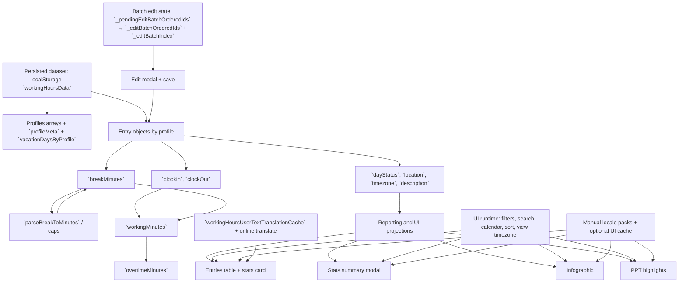
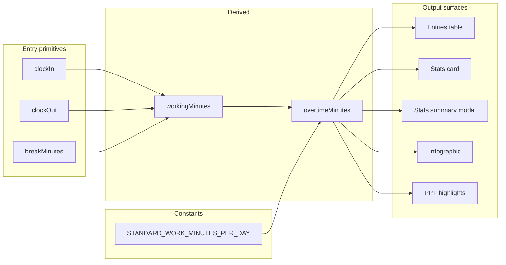

# Variables Documentation

**Last updated:** 2026-03-20

Professional dictionary for persisted keys, runtime state, configuration constants, and calculated values used across Working Hours Tracker. Each row uses a consistent column model: **variable name**, **friendly name**, **definition**, **formula or rule**, **location in the app (code or UI)**, and **example**.

## Scope

This document covers:
- Persisted dataset keys (`localStorage` root, profile metadata, vacation quota, entry objects).
- Runtime UI state (filters, calendar selection, entries selection, view timezone).
- Derived values used consistently by reporting modules (duration, overtime, vacation usage/remaining).

## Canonical Variable Table

| Variable name | Friendly name | Definition | Formula or rule | Location in the app | Example |
|---|---|---|---|---|---|
| `STORAGE_KEY` | Root storage key | `localStorage` key containing the full application dataset as JSON. | Not derived; fixed constant `workingHoursData`. | `js/constants.js` → `W.STORAGE_KEY`; read/write in `js/storage.js` | `workingHoursData` |
| `workingHoursLastProfile` | Last active profile | Profile name persisted so the same context loads after refresh. | Not derived. | `js/storage.js`, `js/init.js`, profile switch handlers | `Default` |
| `workingHoursTheme` | Selected theme | Theme identifier persisted to re-apply CSS token overrides on load. | Not derived. | `js/init.js` (`applyTheme`); token values in `index.html` (`body[data-theme="…"]`) | `indonesia` |
| `workingHoursLanguage` | Selected UI language | Language code (or `auto`) persisted for i18n resolution. | Effective locale: when value is `auto`, baseline resolves to `en` for offline stability unless user applies another language. | `js/i18n.js`, language selector in `index.html` | `auto`, `id`, `fr` |
| `workingHoursUiPackTranslationCache::<locale>` | UI string translation cache | Optional persistent map from English UI source strings to translated strings for a locale. | Not used for offline correctness; network prewarm may populate when explicitly enabled. | `js/i18n.js` | Key suffix `::fr` |
| `workingHoursUserTextTranslationCache` | User text translation cache | Cached translations for user-entered fields (role, descriptions, etc.) keyed by text + target language + context. | Populated when dynamic translation succeeds; read before re-calling translate API. | `js/i18n.js` (`getTranslatedDynamicUserTextCached`, `translateDynamicUserText`) | JSON object in `localStorage` |
| `DEFAULT_TIMEZONE` | Default entry timezone | IANA timezone applied when an entry or import row omits timezone. | Constant in code (`Europe/Berlin`). | `js/constants.js`, `js/time.js`, `js/form.js`, `js/import.js` | `Europe/Berlin` |
| `DAY_NAMES` | Weekday label fallback | English weekday names used when locale-specific labels are unavailable. | Fixed array length 7, Sunday-first. | `js/constants.js`, `js/time.js` | `Sunday` … `Saturday` |
| `STANDARD_WORK_MINUTES_PER_DAY` | Standard workday length | Minutes in a standard workday before overtime accrues. | `8 × 60` | `js/constants.js`; consumers: `js/render.js`, `js/stats-summary.js`, PPT | `480` |
| `NON_WORK_DEFAULTS` | Non-work day template | Default field values when status is sick, holiday, or vacation (UX consistency). | Object literal: `breakMinutes`, `location`, `clockIn`, `clockOut`. | `js/constants.js`; applied in `js/form.js`, `js/modal.js`, `js/voice-entry.js`, `js/clock.js` | `{ breakMinutes: 60, location: 'Anywhere', clockIn: '09:00', clockOut: '18:00' }` |
| `W.BREAK_INPUT_MAX_MINUTES` | Break cap (minutes unit) | Maximum numeric value allowed in the break field when unit is minutes. | Constant `60`. | `js/time.js`; enforced via `syncBreakInputLimits`, `parseBreakToMinutes` | `60` |
| `W.BREAK_INPUT_MAX_HOURS` | Break cap (hours unit) | Maximum numeric value allowed in the break field when unit is hours. | Constant `24`. | `js/time.js` | `24` |
| `id` | Entry ID | Unique entry identifier used for dedupe/selection. | generated | `js/entries.js`, `js/import.js` | `m4xk91...` |
| `createdAt` | Entry created timestamp | ISO timestamp baseline for import freshness. | N/A | `js/entries.js`, `js/import.js`, export/import | `2026-03-01T13:00:00.000Z` |
| `updatedAt` | Entry updated timestamp | ISO timestamp used to keep the newest row during merge. | N/A | `js/import.js`, `js/entries.js` | ISO string |
| `date` | Entry date | ISO day key (`YYYY-MM-DD`) used for filtering and reporting grouping. | N/A | `js/filters.js`, `js/stats-summary.js`, import/export | `2026-03-19` |
| `clockIn` | Clock-in time | Start time in `HH:mm` for duration math. | N/A | `js/form.js`, `js/clock.js`, `js/time.js` | `08:45` |
| `clockOut` | Clock-out time | End time in `HH:mm` for duration math (cross-midnight normalized in import). | N/A | `js/form.js`, `js/import.js`, `js/time.js` | `17:30` |
| `breakMinutes` | Break duration (minutes) | Whole minutes subtracted from clock-in to clock-out span before net work. | From UI: `parseBreakToMinutes(numericValue, unit)` with caps (≤60 min per minute-unit field, ≤24 hour-unit field, ≤1440 min total). Legacy imports may clamp on read paths using the same parser. | Persisted on each entry; edited in `#entryBreak` / `#editBreak` / voice review; logic in `js/time.js` | `60` (one hour) |
| `dayStatus` | Day status | Work classification: `work`, `sick`, `holiday`, `vacation`. | N/A | `js/filters.js`, `js/render.js`, reporting | `work` |
| `location` | Work location | Context code: `WFH`, `WFO`, `Anywhere`. | N/A | `js/filters.js`, `js/render.js` | `WFH` |
| `description` | Description (free text) | User note associated with an entry; may be translated for search/render. | N/A | `js/render.js`, `js/entries-search.js`, `js/i18n.js` | `Feature review` |
| `timezone` | Entry timezone | IANA timezone attached to the entry for display conversion. | N/A | `js/timezone-picker.js`, `js/render.js` | `Asia/Jakarta` |
| `workingMinutes` | Net work minutes | Valid net minutes after break deduction; `null` when times are invalid. | `workingMinutes = max(0, span - breakMinutes)` | `js/time.js` | `465` |
| `overtimeMinutes` | Overtime minutes | Overtime applies only to `dayStatus === 'work'`. | `max(0, workingMinutes - STANDARD_WORK_MINUTES_PER_DAY)` | `js/render.js`, `js/stats-summary.js`, PPT | `35` |
| `vacationDaysByProfile` | Vacation quota map | Annual vacation allowance per profile and year. | N/A | `js/vacation-days.js`, `js/infographic.js` | `{ "Alex": { "2026": 18 } }` |
| `profileMeta` | Profile metadata map | Profile metadata stored under the root dataset (`role`, optional `id`). | N/A | `js/profile.js`, import/export | `{ "Default": { "role": "", "id": "" } }` |
| `lastClock_<profile>` | Last clock helper state | Persisted helper state used to restore clock-in time for the selected date. | N/A | `js/entries.js`, `js/clock.js` | `{ action:"in", time:"09:17", date:"2026-03-19" }` |
| `W._entriesShowAllDates` | Show-all-dates toggle | When `false`, future entries are filtered out. | boolean | `js/init.js`, `js/filters.js` | `true/false` |
| `W._calendarSelectedDates` | Calendar multi-date selection | Selected calendar date strings used to constrain visible entries. | array of `YYYY-MM-DD` | `js/calendar.js`, `js/filters.js` | `[ "2026-03-19" ]` |
| `W._entriesSortBy` | Entries sort key | Active sort field for the entries table. | string key | `js/render.js` | `date` |
| `W._entriesSortDir` | Entries sort direction | Active sort direction. | `asc|desc` | `js/render.js` | `desc` |
| `W._entriesViewTimezone` | Entries view timezone | View timezone used for display conversion of clock times. | IANA timezone | `js/timezone-picker.js`, `js/render.js` | `Europe/Berlin` |
| `W._selectedEntryIds` | Selected entries set | Entry IDs currently selected in the table for bulk actions. | Ordered subset of entry `id` values (selection order may differ from batch edit order). | `js/render.js`, `js/init.js` | `[ "abc", "def" ]` |
| `W._pendingEditBatchOrderedIds` | Pending batch edit queue | IDs staged when opening edit from a multi-select; consumed to start the batch session. | Copy of sorted selection at open time. | `js/init.js` (handlers), `js/render.js` | `[ oldestId, …, newestId ]` |
| `W._editBatchOrderedIds` | Active batch edit queue | Ordered list of entry IDs for the current modal session (oldest → newest). | Maintained across saves until queue empty. | `js/modal.js`, `js/init.js` | `[ id1, id2, id3 ]` |
| `W._editBatchIndex` | Batch edit cursor | Zero-based index into `_editBatchOrderedIds` for the entry shown in the modal. | Incremented after each successful save when batch length > 1. | `js/modal.js` | `0`, `1`, … |
| `filterYear` | Year filter | Selected filter year value (from `#filterYear`). | N/A | `js/filters.js` (`getFilterValues`) | `2026` |
| `filterMonth` | Month filter | Selected filter month value (from `#filterMonth`, 1-12). | N/A | `js/filters.js` (`getFilterValues`) | `3` |
| `filterDay` | Day-of-month filter | Selected day-of-month when advanced mode is enabled. | N/A | `js/filters.js` (`getFilterValues`) | `19` |
| `filterWeek` | ISO week filter | Selected ISO week key (computed per entry using `W.getISOWeek`). | N/A | `js/filters.js` (`getFilterValues`) | `2026-W03` |
| `filterDayName` | Day-of-week filter | Numeric day-of-week selector used by advanced filtering (0..6). | N/A | `js/filters.js` (`getFilterValues`) | `1` (Monday) |
| `filterDayStatus` | Status filter | Filter value for entry `dayStatus`. | N/A | `js/filters.js` (`getFilterValues`) | `work` |
| `filterLocation` | Location filter | Filter value for entry `location` (`WFH`, `WFO`, `Anywhere`). | N/A | `js/filters.js` (`getFilterValues`) | `Anywhere` |
| `filterOvertime` | Overtime filter | Filter for overtime presence on work entries only. | N/A | `js/filters.js` (`getFilterValues`) | `overtime` |
| `filterDescription` | Description availability filter | Advanced filter that checks whether `description` is empty/non-empty. | N/A | `js/filters.js` (`getFilterValues`) | `available` |
| `entriesSearchInput` | Free-text search input | Query text used by semantic typeahead/search matching. | N/A | `js/filters.js` (`getFilterValues`), `js/entries-search.js` | `with overtime and desc available` |

## Runtime helpers (not persisted)

These functions translate between UI controls and stored `breakMinutes`, or refresh limits after programmatic changes.

| Name | Purpose | Formula or rule | Location | Example |
|---|---|---|---|---|
| `W.parseBreakToMinutes(value, unit)` | Convert break number + unit to stored minutes | Minutes: `round(min(value, 60))`. Hours: `round(min(value, 24) × 60)`. | `js/time.js` | `1` hour → `60` |
| `W.breakMinutesToInputFields(totalMinutes)` | Map stored minutes to number + unit for inputs | If `totalMinutes ≤ 60`, use minutes unit; else hours unit with `total / 60`. Total capped at `BREAK_INPUT_MAX_HOURS × 60`. | `js/time.js` | `90` → `{ value: 1.5, unit: 'hours' }` |
| `W.syncBreakInputLimits(valueInputId, unitSelectId)` | Set `min`/`max` on the number input and clamp current value | `max` = 60 or 24 depending on selected unit. | `js/time.js`; called from `js/init.js`, `js/form.js`, `js/modal.js`, `js/voice-entry.js` | After switching to hours, `75` becomes `24` |

## Derived calculation notes

- `workingMinutes` returns `null` when `clockIn` or `clockOut` cannot be parsed or when the span is negative.
- Import normalizes some cross-midnight `clockOut` values via `normalizeClockOut` so duration math remains consistent.

## Relationship chart

High-level data lineage (persisted → derived → surfaces) and how UI state and i18n attach.

### Variable-to-variable formula dependency

Explicit inputs and outputs for derived calculations:

*Note: `overtimeMinutes` is only applied when `dayStatus === 'work'`.*

## Usage Notes

- Update persisted state via module APIs where available (`W.setData`, `W.setEntries`, `W.setVacationDaysBulk`).
- Do not persist derived values like `workingMinutes` or `overtimeMinutes`; recompute from entry primitives to avoid drift.
- Keep field names stable to prevent import/export and reporting regressions.
